__목차__
- [ROS2란 무엇인가?](#ros2란-무엇인가)
  - [**Node**는 로봇을 위한 연산을 수행하는 프로세스](#node는-로봇을-위한-연산을-수행하는-프로세스)
  - [**Message**는 노드 간 통신에 전송되는 Data Structure](#message는-노드-간-통신에-전송되는-data-structure)
  - [ROS2의 구조](#ros2의-구조)
    - [OS Layer](#os-layer)
    - [ROS Middleware Layer (RMW)](#ros-middleware-layer-rmw)
    - [ROS Client Library (RCL)](#ros-client-library-rcl)
  - [대부분의 로봇 연구자들이 ROS를 사용하는 이유](#대부분의-로봇-연구자들이-ros를-사용하는-이유)
    - [Robot에 대한 표준 메시지 정의(2차시 ROS2 개발툴)](#robot에-대한-표준-메시지-정의2차시-ros2-개발툴)
    - [Robot 기하학 라이브러리 제공 (7차시 ROS2 개발툴)](#robot-기하학-라이브러리-제공-7차시-ros2-개발툴)
    - [Robot Description 제공 (8차시 ROS2 시뮬레이션)](#robot-description-제공-8차시-ros2-시뮬레이션)
    - [원격 관제 시스템 제공 (2차시 ROS2 개발툴)](#원격-관제-시스템-제공-2차시-ros2-개발툴)
  - [ROS2 vs ROS1](#ros2-vs-ros1)
  - [Low Level에서 ROS 는 다음의 기능을 제공](#low-level에서-ros-는-다음의-기능을-제공)
    - [Publish/Subscribe Message 전달 (3차시 ROS 통신 - Topic)](#publishsubscribe-message-전달-3차시-ros-통신---topic)
    - [Request/Response 원격 호출 (5차시 ROS 통신 - Service)](#requestresponse-원격-호출-5차시-ros-통신---service)
  - [ROS의 기본적인 Tool들 (Cheat Sheet)](#ros의-기본적인-tool들-cheat-sheet)
    - [Terminal](#terminal)
    - [Graphic Tools](#graphic-tools)
      - [rviz](#rviz)
      - [req\_reconfigure](#req_reconfigure)
      - [rqt\_plot](#rqt_plot)
      - [rqt\_bag](#rqt_bag)
- [ROS2의 사용 예](#ros2의-사용-예)
- [ROS2의 설치법(Humble)](#ros2의-설치법humble)
  - [Ubuntu 22.04 기준 ROS2 Humble Install](#ubuntu-2204-기준-ros2-humble-install)
- [ROS2의 실행 (예)](#ros2의-실행-예)
    - [Node 실행법 (ros2 run)](#node-실행법-ros2-run)
   

# ROS2란 무엇인가?
+ ROS2는 여러가지 프로세스로 구성된 다양한 유형의 통신을 사용하는 로봇용 Middleware  

  + 기본적으로는 Node(프로세스)와 Message(msg, Data Structure)로 구성되어 있음

## **Node**는 로봇을 위한 연산을 수행하는 프로세스
1. 하나의 프로세스로 로봇을 동작시키는 것 보다는 각 기능 별 프로세스를 실행하는 것이 로봇 구동 신뢰성을 높일 수 있음
1. Ex) 제어 Node, 카메라 인식 Node, Lidar를 위한 Slam Node 등

## **Message**는 노드 간 통신에 전송되는 Data Structure
1. 즉 각 노드는 메시지를 사용하여 서로 통신함
1. 표준 기본 유형이 지원 됨(integer, floating point, Boolean, string, ...)

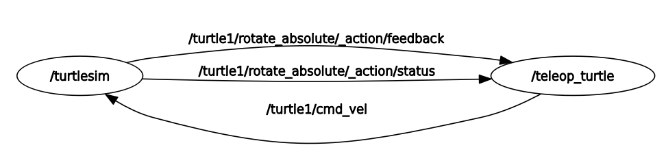


## ROS2의 구조

### OS Layer  
좀 더 다양한 운영체제와 상호 통신이 가능

### ROS Middleware Layer (RMW)  
ROS1은 UDP 통신을 지원하지만, ROS2는 Data Distribution Service (DDS)를 기반으로 통신함  
(선택: Opensource를 쓰거나, 돈을 내고 쓰거나 (보안 Issue))

### ROS Client Library (RCL)  
모든 ROS2 요소의 기본 기능은 rcl이라는 단일 C 라이브러리에서 구현되었음  
그런 다음 rclcpp 및 rclpy 라이브러리는 이 기능을 각 언어, C++ 및 Python의 특수성에 각각 적용

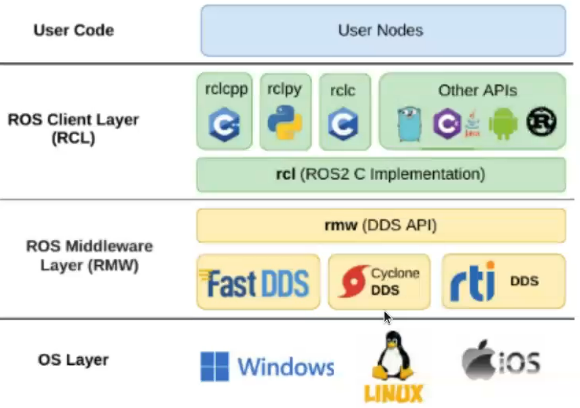


## 대부분의 로봇 연구자들이 ROS를 사용하는 이유

로봇 중심의 특징들을 내포

### Robot에 대한 표준 메시지 정의(2차시 ROS2 개발툴)
1. Pose, Transform, Vector 등 로봇 제어에 필요한 message
1. IMU, PointCloud, Image 등 로봇 센서 시스템에 필요한 message

### Robot 기하학 라이브러리 제공 (7차시 ROS2 개발툴)
1. TF 라이브러리는 로봇의 좌표 변환을 관리함 (Ex. Base에 바라보는 물체의 위치)

### Robot Description 제공 (8차시 ROS2 시뮬레이션)
1. URDF (Unified Robot Description Format)을 사용하여, XML 방식으로 로봇의 형태, 바퀴의 형태 등을 관리
2. 로봇의 물리적 특성 (바퀴의 크기, 마찰력, 무게 등)과 센서들의 정보 (카메라 해상도 등)을 관리

### 원격 관제 시스템 제공 (2차시 ROS2 개발툴)
1. Behavior를 관제하거나, 원격으로 로봇의 동작 상태 등을 관제할 수 있음


## ROS2 vs ROS1
+ 분산형 아키텍쳐 (roscore의 삭제)
+ 통신 방식의 다양화 (Topic, Service, Action)
+ 통신 서비스 품질을 선택할 수 있음 (QoS)
+ 빌드 환경: catkin -> colcon
+ 작업공간의 다양화 (Overay)c

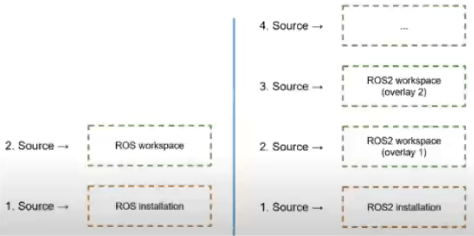

+ 라이프사이클 노드의 탄생
  
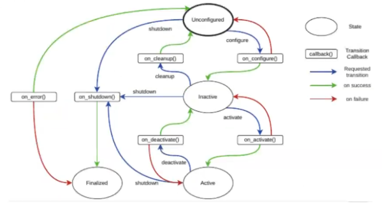


## Low Level에서 ROS 는 다음의 기능을 제공
### Publish/Subscribe Message 전달 (3차시 ROS 통신 - Topic)
1. 익명의 Publish/Subscribe 동기/비동기 통신을 통한 분산 노드 간 통신
1. 통신을 기록 (recording) 해 두고, 이를 다시 재생 (Playback)하여, 디버깅을 하기 용이하게 함

### Request/Response 원격 호출 (5차시 ROS 통신 - Service)
1. 각 프로세스 간 동기식 호출/응답 시스템 제공


## ROS의 기본적인 Tool들 (Cheat Sheet)

### Terminal
+ ros2 daemon: Introspect/configure the ROS2 daemon
+ ros2 launch: Run a launch file
+ ros2 lifecycle: Introspect/manage nodes with managed lifecycles
+ ros2 interface: Introspect msg/srv types
+ ros2 node: Introspect ROS nodes
+ ros2 param: Introspect/configure parameters on a node
+ ros2 pkg: Introspect ROS packages
+ ros2 run: Run ROS nodes
+ ros2 security: Configure security settings
+ ros2 service: Introspect/call ROS services
+ ros2 topic: Introspect/publish ROS topics

### Graphic Tools
#### rviz
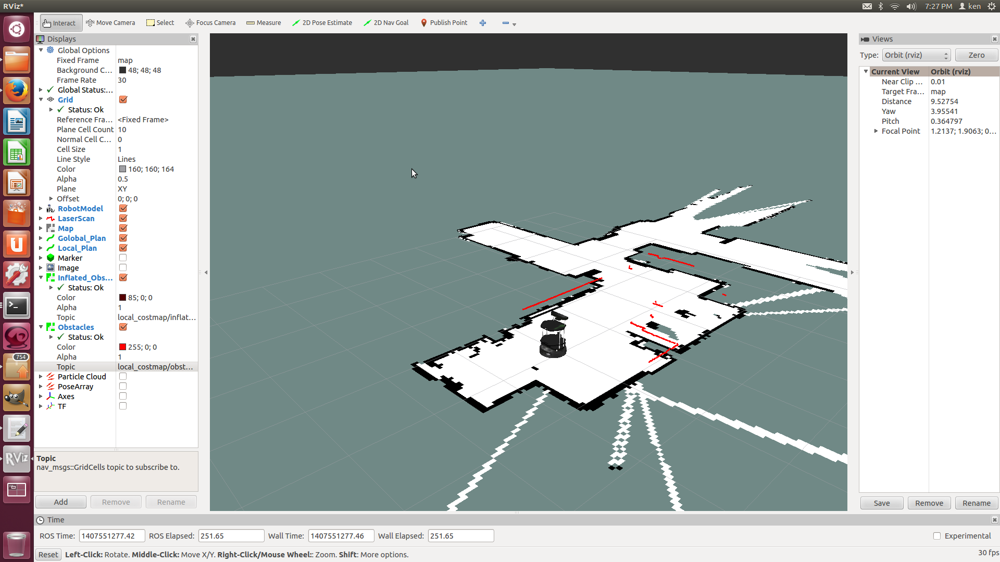

#### req_reconfigure
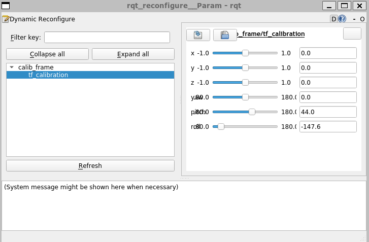

#### rqt_plot
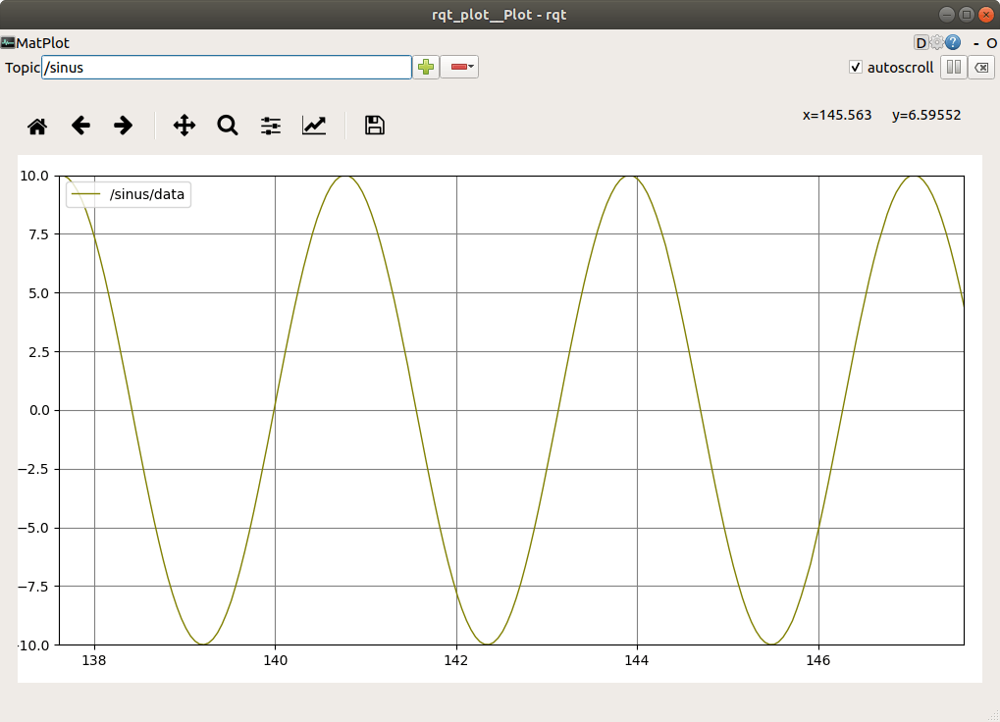

#### rqt_bag
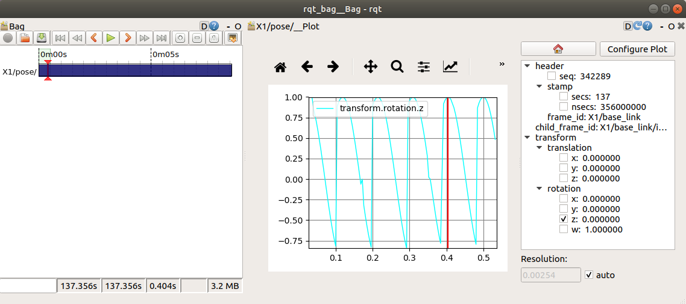


# ROS2의 사용 예
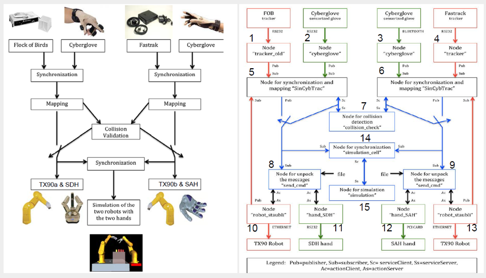
+ Node 1-4: 글로브와 손의 움직임을 트래킹해서 이 위치를 보냄 (Topic Publish)
+ Node 5-6: 노드 1-4의 위치를 획득 (Topic Subscribe), 이를 7번 Node에 충돌 감지를 해주라 요청 (Service Request)
+ Node 8-9: 최적의 위치를 Node 5-6에 전송 받아 (Topic Subscribe), 로봇의 움직임을 부여 (Node 10-13)
  

# ROS2의 설치법(Humble)
## Ubuntu 22.04 기준 ROS2 Humble Install  
참고자료: https://docs.ros.org/en/humble/Installation/Ubuntu-Install-Debians.html

+ Set locale  
```
locale  # check for UTF-8

sudo apt update && sudo apt install locales
sudo locale-gen en_US en_US.UTF-8
sudo update-locale LC_ALL=en_US.UTF-8 LANG=en_US.UTF-8
export LANG=en_US.UTF-8

locale  # verify settings
```
+ Setup Sources

First ensure that the Ubuntu Universe repository is enabled
```
sudo apt install software-properties-common
sudo add-apt-repository universe
```

Now add the ROS 2 GPG key with apt
```
sudo apt update && sudo apt install curl -y
sudo curl -sSL https://raw.githubusercontent.com/ros/rosdistro/master/ros.key -o /usr/share/keyrings/ros-archive-keyring.gpg
```

Then add the repository to your sources list
```
echo "deb [arch=$(dpkg --print-architecture) signed-by=/usr/share/keyrings/ros-archive-keyring.gpg] http://packages.ros.org/ros2/ubuntu $(. /etc/os-release && echo $UBUNTU_CODENAME) main" | sudo tee /etc/apt/sources.list.d/ros2.list > /dev/null
```

+ Install ROS 2 packages  
Update your apt repository caches after setting up the repositories
```
sudo apt update
```

ROS 2 packages are built on frequently updated Ubuntu systems. It is always recommended that you ensure your system is up to date before installing new packages  
```
sudo apt upgrade
```
Desktop Install (Recommended): ROS, RViz, demos, tutorials  
```
sudo apt install ros-humble-desktop
```

Development tools: Compilers and other tools to build ROS packages
```
sudo apt install ros-dev-tools
```

+ Environment setup
  + Sourcing the setup script

Set up your environment by sourcing the following file.
```
echo "source /opt/ros/humble/setup.bash" >> ~/.bashrc
```

+ Additional packages(Optional)

ROS Control 관련
```
sudo apt install ros-humble-ros2-control ros-foxy-ros2-controllers 
sudo apt install ros-humble-rqt*

sudo apt install ros-humble-gazebo-ros-pkgs ros-humble-gazebo-ros2-control
```

ROS TF 관련
```
sudo apt-get install ros-humble-tf2 ros-humble-tf2-tools ros-humble-tf-transformations
```

URDF 관련
```
sudo apt install ros-humble-urdfdom
```

# ROS2의 실행 (예)

### Node 실행법 (ros2 run)
+ ros2 run을 사용하면 패키지 이름을 사용하여 (패키지 경로를 알 필요 없이) 패키지 내의 노드를 직접 실행할 수 있음.
```
ros2 run [package_name] [executable_name]
```
+ 실습 1: 두 개의 터미널 (ctrl+alt+T)을 열고, 2개의 커맨드를 실행
  + Terminal #1
  ```
  ros2 run turtlesim turtlesim_node
  ```
  + Terminal #2
  ```
  ros2 run turtlesim turtle_teleop_key
  ```
  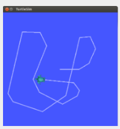
  정사각형 세계에 사는 거북이 모양의 로봇이 포함된 그래픽 창이 표시되어야 합니다. 세 번째 터미널(turtle_teleop_key 명령을 실행하는 터미널)에 입력 포커스를 주고 위쪽, 아래쪽, 왼쪽 또는 오른쪽 키를 누르면 거북이가 명령에 따라 움직이며 뒤에 흔적을 남깁니다.

+ 실습 #2: 다양한 node 명령어 이용해보기
  + Ros2 node는 기본적으로 현재 실행하고 있는 node들을 표현해 줄 수 있음.
    +  list active nodes
    ```
    ros2 node list
    ```
    + print information about node
    ```
    ros2 node info
    ```
+ 실습 #3: rqt_graph의 사용
  + rqt_graph를 이용하여, 동작하고 있는 node 및 각 관계를 살펴봅시다.
  ```
  rqt_graph
  ```
  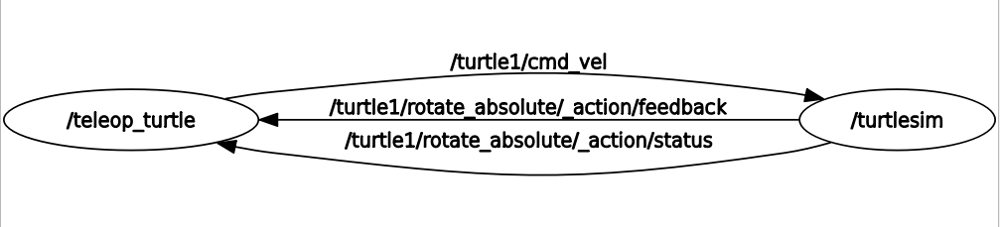

+ 실습 #4: ros2 topic 의 활용
  + ros2 topic은 기본적으로 현재 실행하고 있는 node들의 topic 관계들을 표현해 줄 수 있음.
    + rostopic is a command-line tool for printing information about ROS Topics.
    ```
    ros2 topic –h
    ```
    + Commands
      + display bandwidth used by topic
      ```
      ros2 topic bw
      ```
      + display delay of topic from timestamp in header
      ```
      ros2 topic delay
      ```
      + print messages to screen
      ```
      ros2 topic echo
      ```
      + find topics by type
      ```
      ros2 topic find
      ```
      + display publishing rate of topic
      ```
      ros2 topic hz 
      ```
      + print information about active topic
      ```
      ros2 topic info
      ```
      + list active topics
      ```
      ros2 topic list
      ```
      + publish data to topic
      ```
      ros2 topic pub
      ```
      + print topic or field type
      ```
      ros2 topic type
      ```
  + rostopic echo를 활용하여, tele_op로 터틀봇을 움직일 때 /turtle1/cmd_vel 의 값을 관찰합시다.
  ```
  ros2 topic  echo [topic_name]
  ```
  + rostopic info를 활용하여, /turtle1/cmd_vel 의 Message 형태를 관찰합시다.
  ```
  ros2 topic  info [topic_name]
  ```
  + ros2 interface show를 활용하여, /geometry_msgs/Twist 의 Message 형태를 관찰합시다.
  ```
  ros2 interface show geometry_msgs/Twist
  ```