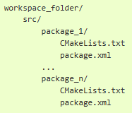

__목차__
- [Basic Concept](#basic-concept)
      - [ROS2는 공식적으로 C(C++), Python3를 사용, 그 외 비공식적으로 C# 및 JavaScript, Rust 등도 사용 가능](#ros2는-공식적으로-cc-python3를-사용-그-외-비공식적으로-c-및-javascript-rust-등도-사용-가능)
      - [ROS2는 공식적으로  Cmakelist.txt, Setup.py를 사용한 Compiler을 활용함](#ros2는-공식적으로--cmakelisttxt-setuppy를-사용한-compiler을-활용함)
- [ROS2 Build System](#ros2-build-system)
    - [각 소스코드들은 package에서 관리하여, 하나의 패키지들은 1개 이상의 소스 코드를 빌드하게 됨](#각-소스코드들은-package에서-관리하여-하나의-패키지들은-1개-이상의-소스-코드를-빌드하게-됨)
    - [ROS의 파일 시스템](#ros의-파일-시스템)
      - [Package는 ROS의 Main Unit!](#package는-ros의-main-unit)
    - [Package의 관리](#package의-관리)
      - [커스텀 패키지들은 사용자의 workspace에서 만듦 (주로 ros2\_ws로 생성)](#커스텀-패키지들은-사용자의-workspace에서-만듦-주로-ros2_ws로-생성)
  - [실습 #1: ros2\_study\_ws 생성 및 등록](#실습-1-ros2_study_ws-생성-및-등록)
  - [실습 #2: ros2 build를 활용한 hello world 실습](#실습-2-ros2-build를-활용한-hello-world-실습)
    - [CMakeLists.txt 와 package.xml은 package 경로에서 만들어줘야 함](#cmakeliststxt-와-packagexml은-package-경로에서-만들어줘야-함)
    - [CMakeLists.txt를 hello\_world 폴더에 생성](#cmakeliststxt를-hello_world-폴더에-생성)
    - [package.xml를 hello\_ros 폴더에 생성](#packagexml를-hello_ros-폴더에-생성)
    - [hello\_ros.cpp를 hello\_ros/src 폴더에 생성](#hello_roscpp를-hello_rossrc-폴더에-생성)
- [ROS2 Logging System](#ros2-logging-system)
    - [ROS는 기본적으로 DEBUG, INFO, WARN, ERROR, FATAL로 분류하여 LOG를 쓸 수 있음.](#ros는-기본적으로-debug-info-warn-error-fatal로-분류하여-log를-쓸-수-있음)
      - [ROS Debug의 예시](#ros-debug의-예시)
  - [실습 #3: 앞서 만든 패키지에 debug\_ex.cpp를 만든 뒤 Debug, Condition 등을 활용해 본다.](#실습-3-앞서-만든-패키지에-debug_excpp를-만든-뒤-debug-condition-등을-활용해-본다)
    - [CMakeLists.txt 추가사항](#cmakeliststxt-추가사항)
    - [debug\_ex.cpp](#debug_excpp)


# Basic Concept
#### ROS2는 공식적으로 C(C++), Python3를 사용, 그 외 비공식적으로 C# 및 JavaScript, Rust 등도 사용 가능

#### ROS2는 공식적으로  Cmakelist.txt, Setup.py를 사용한 Compiler을 활용함
+ 특히, “colcon”이란 Complier를 사용

# ROS2 Build System
### 각 소스코드들은 package에서 관리하여, 하나의 패키지들은 1개 이상의 소스 코드를 빌드하게 됨
+ colcon은 ROS2의 공식 build system

### ROS의 파일 시스템
#### Package는 ROS의 Main Unit!
1. ROS의 runtime process들을 관리 (node)
1. 해당 node들의 dependency를 관리
1. Dataset 등을 관리
1. 알고리즘의 Configuration files 들을 관리

### Package의 관리
#### 커스텀 패키지들은 사용자의 workspace에서 만듦 (주로 ros2_ws로 생성)  
**다음처럼 각 package들은 CmakeLists.txt와 package.xml을 포함한다.**


## 실습 #1: ros2_study_ws 생성 및 등록
+ Workspace 생성
```
$ mkdir ros2_study_ws  # ros2_study_ws의 생성
$ cd ros2_study_ws # ros2_study_ws로의 이동
$ mkdir src # src 폴더의 생성
$ cd .. # 다시 ros2_study_ws로 이동
$ colcon build
```
+ Workspace 등록
  + Catkin_ws를  해당 터미널에 등록
    ```
    $ source install/setup.bash
    ```
  + Workspace 자동등록
    + ros2_ws를 영구적으로 등록  
    (혹은 gedit ~/.bashrc에서 직접 source $HOME/ros2_study_ws/install/setup.bash 추가 해도 됨)
    ```
    $ echo ＂source /$HOME/ros2_ws/install/setup.bash＂ >> ~/.bashrc
    $ source ~/.bashrc
    ```

## 실습 #2: ros2 build를 활용한 hello world 실습
### CMakeLists.txt 와 package.xml은 package 경로에서 만들어줘야 함

+ 이 실습에서는 hello_ros라는 폴더를 package로 함
```
$ cd ros2_ws/src
$ mkdir hello_ros
$ cd hello_ros
```
### CMakeLists.txt를 hello_world 폴더에 생성
```cmake
cmake_minimum_required(VERSION 3.5)

project(hello_ros)

find_package(ament_cmake REQUIRED)

find_package(rclcpp REQUIRED)

add_executable(hello_ros_node src/hello_ros.cpp)

ament_target_dependencies(hello_ros_node rclcpp)

install(TARGETS  hello_ros_node  DESTINATION lib/hello_ros)

ament_package()
```

+ Package의 기본 버전 및 이름 설정
  + **package.xml의 ```<name>```과 일치!**
```cmake
cmake_minimum_required(VERSION 3.5)

project(hello_ros)
```
+ build tool인 ament_cmake를 dependency로 지정
+ rclcpp를 사용하기 위해 dependency로 지정
```cmake
find_package(ament_cmake REQUIRED)

find_package(rclcpp REQUIRED)
```

+ 실행 파일 지정 및 dependencies
```cmake
add_executable(hello_ros_node src/hello_ros.cpp)

ament_target_dependencies(hello_ros_node rclcpp)
```

+ 빌드 대상을 설치 (Node, Launch …)
```cmake
install(TARGETS  hello_ros_node  DESTINATION lib/hello_ros)

ament_package()
```

### package.xml를 hello_ros 폴더에 생성
```xml
<?xml version="1.0"?>
<package format="3">
  <name>hello_ros</name>
  <version>0.0.0</version>

  <description>Ros Build System Tutorial</description>
  <maintainer  email="kim87@khu.ac.kr">Sanghyun Kim</maintainer>
  <license>TODO</license>

  <buildtool_depend>ament_cmake</buildtool_depend>

  <depend>rclcpp</depend>

</package>
```
+ Xml 버전 설정 및 package 이름 및 버전 설정
```xml
<?xml version="1.0"?>
<package format="3">
  <name>hello_ros</name>
  <version>0.0.0</version>
```

+ Package 설명
```xml
<description>Ros Build System Tutorial</description>
  <maintainer email="chohh7391@khu.ac.kr">Hyeonho Cho</maintainer>
  <license>TODO</license>
```

+ Build 방식 선택 및 dependencies지정
```xml
  <buildtool_depend>ament_cmake</buildtool_depend>

  <depend>rclcpp</depend>
```

### hello_ros.cpp를 hello_ros/src 폴더에 생성
```cpp
#include "rclcpp/rclcpp.hpp"

int main(int argc,char *argv[]){
    rclcpp::init(argc,argv);
    auto node = rclcpp::Node::make_shared("hello_ros");

    RCLCPP_INFO(node->get_logger(),"Hello Ros!");

    rclcpp::shutdown();
}
```

+ Ros2 C++ client library 추가
```cpp
#include "rclcpp/rclcpp.hpp"
```

+ Node 이름 초기화 및 생성 (hello_ros)
```cpp
int main(int argc,char *argv[]){
    rclcpp::init(argc,argv);
    auto node = rclcpp::Node::make_shared("hello_ros");
```

+ Ros2 Logging으로 “Hello_Ros!”출력
```cpp
RCLCPP_INFO(node->get_logger(),"Hello Ros!");
```

+ node 종료
```cpp
rclcpp::shutdown();
}
```


# ROS2 Logging System
### ROS는 기본적으로 DEBUG, INFO, WARN, ERROR, FATAL로 분류하여 LOG를 쓸 수 있음.
#### ROS Debug의 예시
```cpp
RCLCPP_INFO(node->get_logger(), "Hello %s", "World");
RCLCPP_DEBUG (node->get_logger(), "Hello " << "World");
RCLCPP_WARN (node->get_logger(), "this is bad");
```

## 실습 #3: 앞서 만든 패키지에 debug_ex.cpp를 만든 뒤 Debug, Condition 등을 활용해 본다.
### CMakeLists.txt 추가사항
+ Node 추가
```cmake
add_executable(debug_node src/debug_ex.cpp)
ament_target_dependencies(debug_node rclcpp)

install(TARGETS
  hello_ros_node
  debug_node
  DESTINATION lib/hello_ros)
```

### debug_ex.cpp
```cpp
#include "rclcpp/rclcpp.hpp"

int main(int argc,char *argv[]){
    rclcpp::init(argc,argv);
    auto node = rclcpp::Node::make_shared("my_node");
    int i=1;
    int a=rclcpp::ok();
     
    rclcpp::Rate loop_rate(10);
    while (rclcpp::ok()) {

        RCLCPP_INFO(node->get_logger(),"Counted to %d",i);
        if((i%3)==0)
            RCLCPP_INFO(node->get_logger()," is devisble by 3.");
        else if((i%5)==0)
            RCLCPP_DEBUG(node->get_logger(), "is devisble by 5.");
        else if((i%7)==0)
            RCLCPP_WARN(node->get_logger() ,"is devisble by 7.");
        else if((i%11)==0)
            RCLCPP_ERROR(node->get_logger() ,"is devisble by 11.");
        else if((i%13)==0)
            RCLCPP_FATAL(node->get_logger() ,"is devisble by 13.");
        i++;
        
        loop_rate.sleep();
    }

    rclcpp::shutdown();
}
```

+ 각 Logging System 출력
```cpp
RCLCPP_INFO(node->get_logger(),"Counted to %d",i);
if((i%3)==0)
    RCLCPP_INFO(node->get_logger()," is devisble by 3.");
else if((i%5)==0)
    RCLCPP_DEBUG(node->get_logger(), "is devisble by 5.");
else if((i%7)==0)
    RCLCPP_WARN(node->get_logger() ,"is devisble by 7.");
else if((i%11)==0)
    RCLCPP_ERROR(node->get_logger() ,"is devisble by 11.");
else if((i%13)==0)
    RCLCPP_FATAL(node->get_logger() ,"is devisble by 13.");
i++;
```