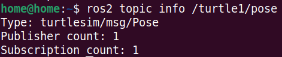
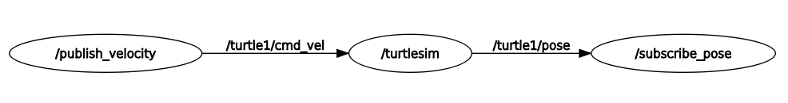
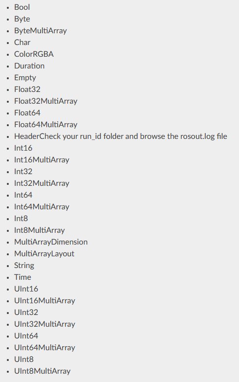
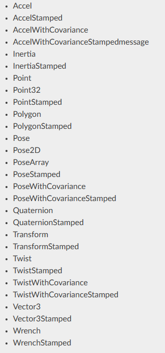

__목차__
- [ROS2 Topic (실습)](#ros2-topic-실습)
  - [(실습1) topic\_ex Package를 만들어, velocity를 publish하고 pose를 subscribe하는 node들을 만들어 본다.](#실습1-topic_ex-package를-만들어-velocity를-publish하고-pose를-subscribe하는-node들을-만들어-본다)
    - [topic\_tutorial 폴더 만들기](#topic_tutorial-폴더-만들기)
    - [CMakeLists.txt 만들기 (2차시 예제 참조)](#cmakeliststxt-만들기-2차시-예제-참조)
    - [Package.xml 만들기 (2차시 예제 참조)](#packagexml-만들기-2차시-예제-참조)
    - [pubvel.cpp 만들기](#pubvelcpp-만들기)
      - [Code 설명 (Publishing Message)](#code-설명-publishing-message)
    - [subpose.cpp 만들기](#subposecpp-만들기)
      - [Code 설명 ()](#code-설명-)
    - [(실습2) 만든 node들을 실행하고, turtle1/pose 의 정보를 ros2 topic info를 이용하여, 파악해 봅시다.](#실습2-만든-node들을-실행하고-turtle1pose-의-정보를-ros2-topic-info를-이용하여-파악해-봅시다)
    - [(실습3) rqt\_graph를 활용하여 노드들간의 관계를 파악해 봅시다.](#실습3-rqt_graph를-활용하여-노드들간의-관계를-파악해-봅시다)
- [ROS Message](#ros-message)
  - [Standard Message (std\_msgs)](#standard-message-std_msgs)
  - [Common Message (sensor\_msgs, geometry\_msgs)](#common-message-sensor_msgs-geometry_msgs)
    - [(실습4) direction 노드를 만들어, turtle1/cmd\_vel의 linear.x가 음수 일 때, std\_msgs/Bool을 이용하여, “Bool을 False” 반대의 경우 True로 퍼블리시하는 publish-subscriber 노드를 만듭시다.](#실습4-direction-노드를-만들어-turtle1cmd_vel의-linearx가-음수-일-때-std_msgsbool을-이용하여-bool을-false-반대의-경우-true로-퍼블리시하는-publish-subscriber-노드를-만듭시다)
      - [direction.cpp 만들기](#directioncpp-만들기)


# ROS2 Topic (실습)
## (실습1) topic_ex Package를 만들어, velocity를 publish하고 pose를 subscribe하는 node들을 만들어 본다.
### topic_tutorial 폴더 만들기  
ros2_ws/src폴더 안에 만들 것
```cpp
$ mkdir topic_tutorial
```

### CMakeLists.txt 만들기 (2차시 예제 참조)
```cmake
cmake_minimum_required(VERSION 3.5)

project(topic_tutorial)

find_package(ament_cmake REQUIRED)

find_package(rclcpp REQUIRED)
find_package(geometry_msgs REQUIRED)
find_package(turtlesim REQUIRED)

add_executable(pubvel_node src/pubvel.cpp)
ament_target_dependencies(pubvel_node rclcpp turtlesim geometry_msgs)
add_executable(subpose_node src/subpose.cpp)
ament_target_dependencies(subpose_node rclcpp turtlesim geometry_msgs)


install(TARGETS  pubvel_node subpose_node DESTINATION lib/topic_tutorial)

ament_package()
```

+ Package 이름을 topic_tutorial로 설정
```cmake
project(topic_tutorial)
```

+ dependencies 추가
```cmake
find_package(geometry_msgs REQUIRED)
find_package(turtlesim REQUIRED)
```

+ 실행 파일 지정 및 dependencies
```cmake
add_executable(pubvel_node src/pubvel.cpp)
ament_target_dependencies(pubvel_node rclcpp turtlesim geometry_msgs)
add_executable(subpose_node src/subpose.cpp)
ament_target_dependencies(subpose_node rclcpp turtlesim geometry_msgs)
```

+ 빌드 대상을 설치 (Node, Launch …)
```cmake
install(TARGETS  pubvel_node subpose_node DESTINATION lib/topic_tutorial)

ament_package()
```

### Package.xml 만들기 (2차시 예제 참조)
```xml
<?xml version="1.0"?>
<package format="3">
  <name>topic_tutorial</name>
  <version>0.0.0</version>

  <description>Ros Topic System Tutorial</description>
  <maintainer  email="kim87@khu.ac.kr">Sanghyun Kim</maintainer>
  <license>TODO</license>

  <buildtool_depend>ament_cmake</buildtool_depend>
  
  <depend>rclcpp</depend>
  <depend>geometry_msgs</depend>
  <depend>turtlesim</depend>
</package>
```

+ Package 이름을 topic_tutorial로 설정
```xml
<name>topic_tutorial</name>
```

+ 추가 dependencies 설정
```xml
<depend>geometry_msgs</depend>
<depend>turtlesim</depend>
```

### pubvel.cpp 만들기
``` cpp

#include "rclcpp/rclcpp.hpp"
#include <stdlib.h>
#include "geometry_msgs/msg/twist.hpp"

int main(int argc, char *argv[])
{
    rclcpp::init(argc,argv);
    auto node = std::make_shared<rclcpp::Node>("publish_velocity");
    auto publisher = node->create_publisher<geometry_msgs::msg::Twist>("turtle1/cmd_vel", 10);
    
    auto twist_msg = std::make_unique<geometry_msgs::msg::Twist>();
    
    rclcpp::Rate loop_rate(10);
    srand(time(0));
    while (rclcpp::ok()) {
        twist_msg->linear.x = double(rand()-double(RAND_MAX)/2.0)/double(RAND_MAX);
        twist_msg->angular.z = 2*double(rand())/double(RAND_MAX) - 1;
        publisher->publish(*twist_msg);
        rclcpp::spin_some(node);
        RCLCPP_INFO(node->get_logger(), \
        "Twist Message - Linear X: %f, Angular Z: %f", \
        twist_msg->linear.x, twist_msg->angular.z);
        loop_rate.sleep();
    }
    rclcpp::shutdown();
}
```

+ turtle1/cmd_vel topic에 Twist 메시지 전달할 publisher 생성
```cpp
auto publisher = node->create_publisher<geometry_msgs::msg::Twist>("turtle1/cmd_vel", 10);
```

+ Twist타입의 메시지 생성
```cpp
auto twist_msg = std::make_unique<geometry_msgs::msg::Twist>();
```

+ 생성된 twist_msg에 임의의 속도값을 설정
```cpp
while (rclcpp::ok()) {
    twist_msg->linear.x = double(rand()-double(RAND_MAX)/2.0)/double(RAND_MAX);
    twist_msg->angular.z = 2*double(rand())/double(RAND_MAX) - 1;
```

+ Publisher 객체에 속도값을 넣은 twist_msg를 넣어 전달
```cpp
publisher->publish(*twist_msg);
```

+ while문이 설정된 loop_rate에 따라 자동으로 돌기 위해 '''rclcpp::spin_some'''사용
```cpp
rclcpp::spin_some(node);
```

#### Code 설명 (Publishing Message)
+ **Message** Type: 각 topic들은 정해진 message 규격을 따른다.
```cpp
#include “geometry_msgs/msg/twist.hpp”
```

+ **Publishing Object**: 각 messages는 지정된 topic을 통해 “발간＂된다.
```cpp
auto publisher = node->create_publisher<message type>(“topic_name”,queue_size)
```
```
- node->create_publisher : an object of class node

- message_type: — formally called the template parameter — is the data type for the messages(본 예제에서는 geometry::msgs::Twist)

- topic_name: a string containing the name of the topic on which we want to publish  (본 예제에서는 turtle1/cmd_vel )

- queue_size: the size of the queue where messages are stored. 
```


+ **Message Object**: msg를 geometry_msgs/Twist로 생성하고, msg안에 다양한 값들을 넣어준다.

+ **Publishing Message**: 마지막으로 message object를 publishing object에 삽입하여, publish
```cpp
publisher->publish(*msg);
```

### subpose.cpp 만들기
```cpp
#include "rclcpp/rclcpp.hpp"
#include "turtlesim/msg/pose.hpp"

void poseCallback(const turtlesim::msg::Pose::SharedPtr msg) {
    // Pose 메시지를 수신할 때 호출되는 콜백 함수
    double x = msg->x;
    double y = msg->y;
    double theta = msg->theta;

    RCLCPP_INFO(rclcpp::get_logger("rclcpp"), "TurtleBot Pose - X: %f, Y: %f, Theta: %f", x, y, theta);
}

int main(int argc, char *argv[]) {
    rclcpp::init(argc, argv);

    auto node = rclcpp::Node::make_shared("subscribe_pose");
    auto pose_sub = node->create_subscription<turtlesim::msg::Pose>("turtle1/pose", 10, poseCallback);

    rclcpp::spin(node);

    rclcpp::shutdown();
}
```

+ Pose msg를 수신받을 때마다 호출되는 Callback함수 생성
  + obot의 위치를 x,y,theta로 받아 출력 
```cpp
void poseCallback(const turtlesim::msg::Pose::SharedPtr msg) {
    // Pose 메시지를 수신할 때 호출되는 콜백 함수
    double x = msg->x;
    double y = msg->y;
    double theta = msg->theta;

    RCLCPP_INFO(rclcpp::get_logger("rclcpp"), "TurtleBot Pose - X: %f, Y: %f, Theta: %f", x, y, theta);
}
```

+ subscribe_node를 생성
```cpp
auto node = rclcpp::Node::make_shared("subscribe_pose");
```

+ turtle1/pose를 poseCallback함수를 통해 Subscribe한다고 설정
```cpp
auto pose_sub = node->create_subscription<turtlesim::msg::Pose>("turtle1/pose", 10, poseCallback);
```

+ topic들이 들어올 때마다 callback함수가 잘 실행되도록 rclcpp::spin을 사용
```cpp
rclcpp::spin(node);
```

#### Code 설명 ()
+ **CallBack 함수** : 얻은 message를 통해 어떤 작업을 수행할 것인가?
  + Topic이 도착할 때마다 수행되는 함수
  ```cpp
  void function_name(const package_name::type_name &msg)
  ```
+ Subscriber Object : 어떤 토픽을 받을 것인지 생성해야하는 오브젝트
```cpp
auto pose_sub = node->create_subscription<Message_type>(“Topic Name", queue_size, Callback function);
```
```
- node->create_subscription : an object of class node

- topic_name: a string containing the name of the topic on which we want to publish  (본 예제에서는 turtle1/pose )

-  pointer_to_callback_function is the pointer to the callback function, &poseMessageReceived in the example
```

+ rclcpp::spin(node)
  + ROS에게 노드가 종료될 때까지 콜백을 기다리고 실행하도록 요청
  + 즉, 대략 다음 루프와 동일
  ```cpp
  While (ros::ok())
    {Callback function;}
  ```


### (실습2) 만든 node들을 실행하고, turtle1/pose 의 정보를 ros2 topic info를 이용하여, 파악해 봅시다.
```
$ ros2 topic info /turtle1/pose
```


### (실습3) rqt_graph를 활용하여 노드들간의 관계를 파악해 봅시다.
```
$ rqt_graph
```



# ROS Message
## Standard Message (std_msgs)
- http://wiki.ros.org/std_msgs


## Common Message (sensor_msgs, geometry_msgs)
+ sensor_msgs
http://wiki.ros.org/sensor_msgs

+ geometry_msgs
http://wiki.ros.org/sensor_msgs



### (실습4) direction 노드를 만들어, turtle1/cmd_vel의 linear.x가 음수 일 때, std_msgs/Bool을 이용하여, “Bool을 False” 반대의 경우 True로 퍼블리시하는 publish-subscriber 노드를 만듭시다.

#### direction.cpp 만들기
```cpp
#include "rclcpp/rclcpp.hpp"
#include "geometry_msgs/msg/twist.hpp"
#include "std_msgs/msg/bool.hpp"

rclcpp::Publisher<std_msgs::msg::Bool>::SharedPtr bool_publisher;

void twistCallback(const geometry_msgs::msg::Twist::SharedPtr msg) {

    // Add your logic here based on the received linear.x value
    bool LinearXSign = (msg->linear.x >= 0.0);

    // Publish the bool value based on the condition
    std_msgs::msg::Bool bool_msg;
    bool_msg.data = LinearXSign;
    if(LinearXSign)
        RCLCPP_INFO(rclcpp::get_logger("turtle_control_node"), "Bool linear.x: True");
    else
        RCLCPP_INFO(rclcpp::get_logger("turtle_control_node"), "Bool linear.x: False");
    bool_publisher->publish(bool_msg);
}

int main(int argc, char *argv[]){
    rclcpp::init(argc, argv);
    auto node = rclcpp::Node::make_shared("turtle_control_node");
    bool_publisher = node->create_publisher<std_msgs::msg::Bool>("linear_x_sign", 10);
    auto twist_subscription = node->create_subscription<geometry_msgs::msg::Twist>(
        "turtle1/cmd_vel",
        10,
        twistCallback
    );

    rclcpp::spin(node);

    rclcpp::shutdown();

    return 0;
}
```

+ Callback함수를 통해 Message를 /turtle1/cml_vel을 subscribe했을 때 동작을 설명
```cpp
rclcpp::Publisher<std_msgs::msg::Bool>::SharedPtr bool_publisher;

void twistCallback(const geometry_msgs::msg::Twist::SharedPtr msg) {

    // Add your logic here based on the received linear.x value
    bool LinearXSign = (msg->linear.x >= 0.0);

    // Publish the bool value based on the condition
    std_msgs::msg::Bool bool_msg;
    bool_msg.data = LinearXSign;
    if(LinearXSign)
        RCLCPP_INFO(rclcpp::get_logger("turtle_control_node"), "Bool linear.x: True");
    else
        RCLCPP_INFO(rclcpp::get_logger("turtle_control_node"), "Bool linear.x: False");
    bool_publisher->publish(bool_msg);
}
```

+ turtle_control_node를 생성
```cpp
rclcpp::init(argc, argv);
auto node = rclcpp::Node::make_shared("turtle_control_node");
```

+ publisher, subsrciber을 node에서 생성 이를 callback함수로 전달
```cpp
bool_publisher = node->create_publisher<std_msgs::msg::Bool>("linear_x_sign", 10);
auto twist_subscription = node->create_subscription<geometry_msgs::msg::Twist>(
    "turtle1/cmd_vel",
    10,
    twistCallback
);
```

