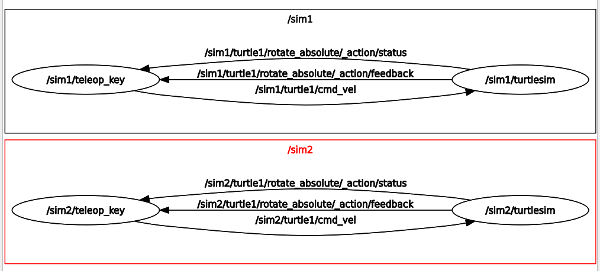
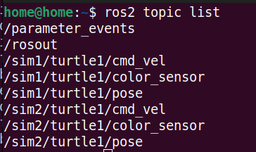
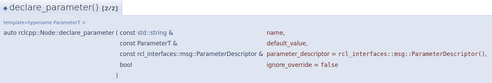
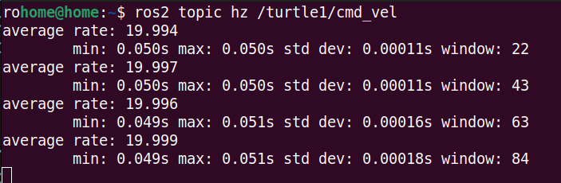
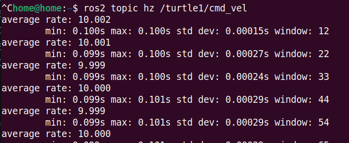

__목차__
- [Launch File](#launch-file)
  - [Ros2 run vs Launch File](#ros2-run-vs-launch-file)
      - [Launch File](#launch-file-1)
  - [Launch File 의 구성](#launch-file-의-구성)
      - [이름 및 위치](#이름-및-위치)
      - [파일 구조](#파일-구조)
  - [xml 형식 Launch File](#xml-형식-launch-file)
    - [(실습 1) randvelturtlesim\_launch.xml](#실습-1-randvelturtlesim_launchxml)
  - [.launch.py 형식 Launch File](#launchpy-형식-launch-file)
    - [(실습 2-3) randvelturtlesim\_launch.xml 파일을 randvel.launch.py 로 수정](#실습-2-3-randvelturtlesim_launchxml-파일을-randvellaunchpy-로-수정)
  - [DeclareLaunchArgument(): Arguments를 정의하는 함수](#declarelaunchargument-arguments를-정의하는-함수)
    - [turtleflag.launch.py](#turtleflaglaunchpy)
      - [DeclareLaunchArgument](#declarelaunchargument)
      - [LaunchConfiguration](#launchconfiguration)
    - [(실습 4)](#실습-4)
  - [추가기능: 네임스페이스(namespace)를 활용한 다양한 Node 구성](#추가기능-네임스페이스namespace를-활용한-다양한-node-구성)
    - [namespace.launch.py](#namespacelaunchpy)
  - [추가 기능: Remapping(ns)을 활용한 기존 Topic들을 활용](#추가-기능-remappingns을-활용한-기존-topic들을-활용)
    - [Remapping 이란?](#remapping-이란)
    - [(실습 6) turtle\_teleop\_key 에서 발생하는 cmd\_vel을 subscribe 하여, 반대 방향으로 동작하게 코드를 작성](#실습-6-turtle_teleop_key-에서-발생하는-cmd_vel을-subscribe-하여-반대-방향으로-동작하게-코드를-작성)
      - [reverse.cpp](#reversecpp)
      - [reverse.launch.py](#reverselaunchpy)
        - [Remapping](#remapping)
- [ROS2 Parameter](#ros2-parameter)
  - [ROS2 Parameter를 왜 사용하는 가?](#ros2-parameter를-왜-사용하는-가)
    - [parameter.cpp](#parametercpp)
      - [declare\_parameter](#declare_parameter)
        - [get\_parameter](#get_parameter)
      - [parameter.launch.py](#parameterlaunchpy)


# Launch File
## Ros2 run vs Launch File
#### Launch File
  + 시작 파일의 모든 노드는 거의 동시에 시작됩니다. 결과적으로 노드가 자체적으로 초기화되는 순서를 확신할 수 없습니다. 잘 작성된 ROS 노드는 자신과 형제 노드가 시작되는 순서에 신경 쓰지 않습니다.
  + 기본적으로 시작된 노드의 표준 출력은 터미널이 아니라 로그 파일(∼/.ros/log/```<ros2_runtime>```/node/```<unique_n.log>```)입니다.
    + <ros2_runtime>:setup.bash를 통해 활성화된 ID
	+ <unique_node_id>:실행중인 각 노드에 할당된 고유 id
  + 활성 ros2 launch를 종료하려면 Ctrl-C를 사용하세요. 이 신호는 실행 시 각 활성 노드를 정상적으로 종료하려고 시도합니다.

## Launch File 의 구성
#### 이름 및 위치
+ 각 실행 파일은 특정 패키지와 연결되어야 합니다.
+ 일반적인 명명 방식은 .py로 끝나는 시작 파일 이름을 지정하는 것입니다.
+ 패키지 디렉토리에 직접 저장되거나 일반적으로 launch라는 하위 디렉토리에 저장됩니다.

#### 파일 구조
1. Root  
    LaunchDesrciption-Node,Action,Service가 실행 가능
    ```python
    def generate_launch_description():
        return LaunchDescription([])
    ```

2. Arg
    ```python
    DeclareLaunchArgument(
        'variable_name',
        default_value= 'default_variable',
        description='variable_description'
    )
    ```

3. Node
    ```python
    Node( 
        package="package_name",
        executable="excutable_file",
        name="excutable_node",
        parameter=[{'name': 'value'}],
        remapping=[('old topic name','new topic name')]
    )
    ```

## xml 형식 Launch File
### (실습 1) randvelturtlesim_launch.xml
+ pubvel_node 와 subpose_node를 다같이 실행
+ output이 screen에 출력
```xml
<launch>
  <node pkg="turtlesim" exec="turtlesim_node" name="turtle1" />
  <node
    pkg="launch_tutorial"
    exec="pubvel_node"
    name="vel_publisher"
    output="screen"
  />
  <node
    pkg="launch_tutorial"
    exec="subpose_node"
    name="pose_subscriber"
    output="screen"
  />
</launch>
```

## .launch.py 형식 Launch File
### (실습 2-3) randvelturtlesim_launch.xml 파일을 randvel.launch.py 로 수정
+ 아래의 Node를 함께 실행하는 Launch File
  + turtlesim_node
  + pubvel_node
  + subpose_node
```python
import launch
from launch_ros.actions import Node

def generate_launch_description():
    return launch.LaunchDescription([
        Node(
            package='turtlesim',
            executable='turtlesim_node',
            name='turtlesim',
            output='screen',
            emulate_tty=True,
            respawn=True
        ),
        Node(
            package='launch_tutorial',
            executable='pubvel_node',
            name='vel_publisher',
            output='screen'
            
        ),

        Node(
            package='launch_tutorial',
            executable='subpose_node',
            name='pose_subscriber',
            output='screen'
        ),
    ])

if __name__ == '__main__':
    generate_launch_description()
```

+ import
  +  launch: ROS2 launch file을 만들고 관리하는 데 사용
     +  LaunchDescription
  +  Node: 실행할 node를 관리하기 위해 사용
```python
import launch
from launch_ros.actions import Node
```

+ launch.LaunchDescription을 return하면 launch file이 실행되는 것
```python
launch.LaunchDescription([...])
```

+ **Node**: 실행할 Node를 정의
  + package: Node가 포함된 Package name (CMakeLists.txt에서 정의되어 있음)
  + excutable: Node name (CMakeLists.txt에서 정의되어 있음)
    + package와 excutable로 어떤 Node를 실행할 지 정의
  + **name**: 위에서 정의된 Node의 이름을 정함
    + 실행 중인 여러 노드를 구분하기 위한 것
      + 동일한 Node를 다른 이름으로 구분하는 역할도 함
  + **output='screen'**: screen에 Node의 출력을 보여줄 지를 정함
    + launch file이 실행되는 터미널 상에서를 의미
  + **emulate_tty**
    + True: 색상 형식화 및 터미널 제어 시퀀스를 사용하여 로그를 더 가독성 있게 표시
    + False: 로그 메시지가 색상 형식화나 터미널 제어 시퀀스를 사용하지 않고 출력되어, 로그 메시지가 터미널에 표시될 때 덜 혼란스럽게 보일 수 있음
  + **spawn**
    + True: Node가 꺼졌을 때, Node를 다시 킴
    + False: Node가 꺼졌을 때, Node를 다시 키지 않음
    + 
```python
Node(
    package='turtlesim',
    executable='turtlesim_node',
    name='turtlesim',
    output='screen',
    emulate_tty=True,
    respawn=True
)
```

## DeclareLaunchArgument(): Arguments를 정의하는 함수
### turtleflag.launch.py
```py
from launch import LaunchDescription
from launch_ros.actions import Node
from launch.actions import DeclareLaunchArgument
from launch.conditions import IfCondition, UnlessCondition
from launch.substitutions import LaunchConfiguration

def generate_launch_description():
    return LaunchDescription([
        DeclareLaunchArgument(
            'use_teleop',
            default_value='1',
            description='Flag to indicate whether to use teleop or not'
        ),

        Node(
            package='turtlesim',
            executable='turtlesim_node',
            name='turtlesim_node',
            output='screen'
        ),

        Node(
            package='turtlesim',
            executable='turtle_teleop_key',
            name='teleop_key',
            output='screen',
            prefix='xterm -e',
            condition=IfCondition(LaunchConfiguration('use_teleop'))
        ),

        Node(
            package='topic_tutorial',
            executable='pubvel_node',
            name='vel_publisher',
            output='screen',
            condition=UnlessCondition(LaunchConfiguration('use_teleop'))
        ),

        Node(
            package='topic_tutorial',
            executable='subpose_node',
            name='pose_subscriber',
            output='screen',
            condition=UnlessCondition(LaunchConfiguration('use_teleop'))
        ),
    ])
```

+ DeclareLaunchArgument를 사용하기 위한 import
```py
from launch.actions import DeclareLaunchArgument
```

#### DeclareLaunchArgument
+ 형식
```py
DeclareLaunchArgument(
    'arg_name',
    default_value='defalut_value you want',
    description='description of argument'
)
```
```py
DeclareLaunchArgument(
    'use_teleop',
    default_value='1',
    description='Flag to indicate whether to use teleop or not'
)
```

#### LaunchConfiguration
+ 해당 argument의 value를 찾음
  + IfCondition
    + True 일 때 해당 Node를 실행
  + UnlessCondition
    + False 일 때 해당 Node를 실행

### (실습 4)
+ 'use_teleop'이라는 arg는 default로 1이므로 turtle_teleop_key이 실행됨
```
$ ros2 launch launch_tutorial turtleflag.launch.py
```

+ 'use_teleop'를 터미널에서 use_teleop:=False 로 하면
  + turtle_teleop_key 실행 x
  + pubvel_node 와 subpose_node가 실행
```py
ros2 launch launch_tutorial turtleflag.launch.py use_teleop:=False
```


## 추가기능: 네임스페이스(namespace)를 활용한 다양한 Node 구성
### namespace.launch.py
+ xterm을 install 해야 정상적으로 실행 가능
```
sudo apt install xterm
```
```py
from launch import LaunchDescription
from launch_ros.actions import Node

def generate_launch_description():
    return LaunchDescription([
        Node(
            package='turtlesim',
            executable='turtlesim_node',
            name='turtlesim',
            namespace='sim1',
            output='screen',
            respawn=True,
        ),
        Node(
            package='turtlesim',
            executable='turtle_teleop_key',
            name='teleop_key',
            namespace='sim1',
            output='screen',
            prefix='xterm -e',
        ),
        Node(
            package='turtlesim',
            executable='turtlesim_node',
            name='turtlesim',
            namespace='sim2',
            output='screen',
            respawn=True,
        ),
        Node(
            package='turtlesim',
            executable='turtle_teleop_key',
            name='teleop_key',
            namespace='sim2',
            output='screen',
            prefix='xterm -e',
        ),
    ])
```
+ rqt_graph로 찍어보면 아래와 같이 namespace가 적용된 것을 알 수 있음
  + sim1
  + sim2


+ topic list를 보면 launch file의 namespace에서 설정한 대로 topic이 구분됨
  + /sim1
  + /sim2

```
turtle1/cmd_vel -> /sim1/turtle1/cmd_vel  
   	    	   /sim2/turtle1/cmd_vel

turtle1/pose -> /sim1/turtle1/pose  
   	    	   /sim2/turtle1/pose
```




## 추가 기능: Remapping(ns)을 활용한 기존 Topic들을 활용
### Remapping 이란?
    Node에 사용되는 Topic 이름들을 코드의 수정없이, Launch에서 수정할 수 있는 기능

+ turtle1/pose로 publish 되는 topic을 “tim”이라는 이름으로 remapping
+ **remappings라고 입력해야 함(remapping x)
```py
Node(
    package="turtlesim",
    executable="turtlesim_node",
    name:"turtlesim"
    remappings[("/turtle1/pose", "tim")]
)
```

### (실습 6) turtle_teleop_key 에서 발생하는 cmd_vel을 subscribe 하여, 반대 방향으로 동작하게 코드를 작성
#### reverse.cpp
```cpp
#include "rclcpp/rclcpp.hpp"
#include "geometry_msgs/msg/twist.hpp"

class ReverseVelocity : public rclcpp::Node {
public:
    ReverseVelocity()
    : Node("reverse_velocity")
    {
        pub_ = this->create_publisher<geometry_msgs::msg::Twist>(
        "turtle1/cmd_vel_reversed", 1000);

        sub_ = this->create_subscription<geometry_msgs::msg::Twist>(
        "turtle1/cmd_vel", 1000,
        [this](const geometry_msgs::msg::Twist::SharedPtr msgIn) {
            geometry_msgs::msg::Twist msgOut;
            msgOut.linear.x = -msgIn->linear.x;
            msgOut.angular.z = -msgIn->angular.z;
            pub_->publish(msgOut);
        });
    }

private:
    rclcpp::Publisher<geometry_msgs::msg::Twist>::SharedPtr pub_;
    rclcpp::Subscription<geometry_msgs::msg::Twist>::SharedPtr sub_;
};

int main(int argc, char **argv) {
    rclcpp::init(argc, argv);
    rclcpp::spin(std::make_shared<ReverseVelocity>());
    rclcpp::shutdown();
    return 0;
}
```

+ 이 코드에서 class로 c++ code를 짜는 방식
  + private에 publisher 와 subscriber를 정의
  + rclcpp::Node를 inherit받아 publisher와 subscription을 넣어줌
    + create_publisher
    + create_subscription
      + 함수 내에서 callback함수를 정의

#### reverse.launch.py  
**turtlesim_node에서 사용하는 /turtle1/cmd_vel이라는 topic을 모두 /turtle1/cmd_vel_reversed으로 remapping**
```py
# turtlesim_launch.py
import launch
from launch_ros.actions import Node

def generate_launch_description():
    return launch.LaunchDescription([
        Node(
            package='turtlesim',
            executable='turtlesim_node',
            name='turtlesim',
            output='screen',
            emulate_tty=True,
            remappings=[('/turtle1/cmd_vel', '/turtle1/cmd_vel_reversed')]
        ),
        Node(
            package='turtlesim',
            executable='turtle_teleop_key',
            name='teleop_key',
            output='screen',
            prefix='xterm -e'
        ),
        Node(
            package='launch_tutorial',
            executable='reverse_node',
            name='reverse_velocity',
            output='screen',
            emulate_tty=True
        ),	
    ])

if __name__ == '__main__':
    generate_launch_description()

```

##### Remapping 
+ 해당 Node에서 사용하는 topic name을 새로운 topic name 으로 remapping
  + old topic name -> new topic name
    ```py
    remappings=[(‘old topic name’,’new topic name’)]
    ```
    ```py
    remappings=[('/turtle1/cmd_vel', '/turtle1/cmd_vel_reversed')]
    ```


# ROS2 Parameter
## ROS2 Parameter를 왜 사용하는 가?

+ C++ 등에서 자주 바꾸는 변수를 선언하면, 그때 그때마다 빌드를 하여 활용하여야 함.

  + ROS2에는 노드에서 쿼리할 값 모음을 추적하는 파라미터 서버가 있으며, 기본적으로 시간이 지나도 (많이) 변경되지 않는 구성 정보를 저장.
  
현재 저장된 파라미터를 확인하고 싶을 때
```
$ ros2 param list
```

현재 저장된 파라미터의 값을 확인하고 싶을 때
```
$ ros2 param get parameter_name
```

현재 저장된 파라미터의 값을 세팅하고 싶을 때
```
$ ros2 param set parameter_name value
```

### parameter.cpp
cmd_vel을 몇 Hz마다 발간할 지, 파라미터로 결정하는 code
```cpp
#include "rclcpp/rclcpp.hpp"
#include "geometry_msgs/msg/twist.hpp"
#include "std_msgs/msg/string.hpp"
#include <cstdlib>

int main(int argc, char **argv) {

    rclcpp::init(argc, argv);
    auto node = rclcpp::Node::make_shared("publish_velocity");

    auto pub = node->create_publisher<geometry_msgs::msg::Twist>("turtle1/cmd_vel", 1000);

    node->declare_parameter("cmd_vel_rate", 10.0);

    // Seed the random number generator.
    std::srand(std::time(0));
    
    double frequency=10.0;
    
    if (!node->get_parameter("cmd_vel_rate", frequency)) {
        RCLCPP_FATAL(node->get_logger(), "Could not get parameter cmd_vel_rate. Please set it from the command line");
        rclcpp::shutdown();
        return 1;
    }

    rclcpp::WallRate rate(frequency);
    while (rclcpp::ok()) {
        auto msg = std::make_unique<geometry_msgs::msg::Twist>();
        msg->linear.x = static_cast<double>(std::rand()) / static_cast<double>(RAND_MAX);
        msg->angular.z = 2 * static_cast<double>(std::rand()) / static_cast<double>(RAND_MAX) - 1;

        pub->publish(*msg);

        RCLCPP_INFO(node->get_logger(),
                    "Sending random velocity command: linear=%.2f angular=%.2f",
                    msg->linear.x, msg->angular.z);

        rate.sleep();
    }

    rclcpp::shutdown();
    return 0;
}

```
#### declare_parameter  
parameter를 사용하기 위해서는 아래와 declare_parameter를 사용하여 선언해 주어야 함
+ 형식



default가 10.0인 "cmd_vel_rate"라는 parameter를 선언 
```cpp
node->declare_parameter("cmd_vel_rate", 10.0);
```

##### get_parameter  
cmd_vel_rate라는 parameter를 찾고 존재한다면, frequency라는 변수에 대입하고 rate를 frequency로 설정
```cpp
if (!node->get_parameter("cmd_vel_rate", frequency)) {
    RCLCPP_FATAL(node->get_logger(), "Could not get parameter cmd_vel_rate. Please set it from the command line");
    rclcpp::shutdown();
    return 1;
}

rclcpp::WallRate rate(frequency);
```

#### parameter.launch.py
```py
from launch import LaunchDescription
from launch_ros.actions import Node
from launch.actions import DeclareLaunchArgument
from launch.substitutions import LaunchConfiguration

def generate_launch_description():
    return LaunchDescription([
        DeclareLaunchArgument(
            'frequency',
            default_value='20.0',
            description='determine frequency'
        ),

        Node(
            package='turtlesim',
            executable='turtlesim_node',
            name='turtlesim',
            output='screen',
            respawn=True
        ),

        Node(
            package='launch_tutorial',
            executable='parameter_node',
            name='parameter',
            output='screen',
            parameters=[{'cmd_vel_rate': LaunchConfiguration('frequency')}],
            respawn=True
        ),
    ])

if __name__ == '__main__':
    generate_launch_description()
```

+ Node에서 parameters로 parameter를 정해줄 수 있음
+ LaunchConfiguration을 통해 launch file의 arg의 값을 받아서 쓸 수도 있음
```py
parameters=[{'cmd_vel_rate': LaunchConfiguration('frequency')}]
```


+ 아래와 같이 default_value를 설정한 대로 hz가 바뀌는 것을 알 수 있음
```
$ ros2 topic hz /turtle1/cmd_vel
```
```py
default_value='20.0
```


```py
default_value='10.0
```
