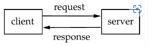
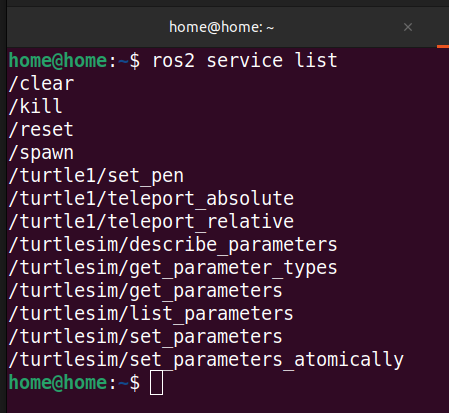
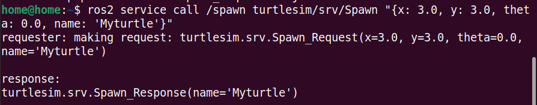
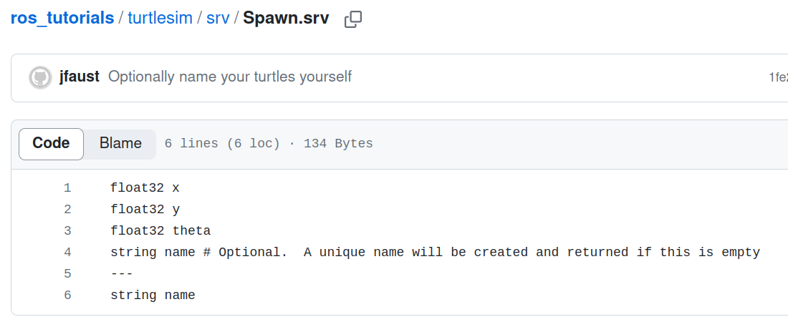
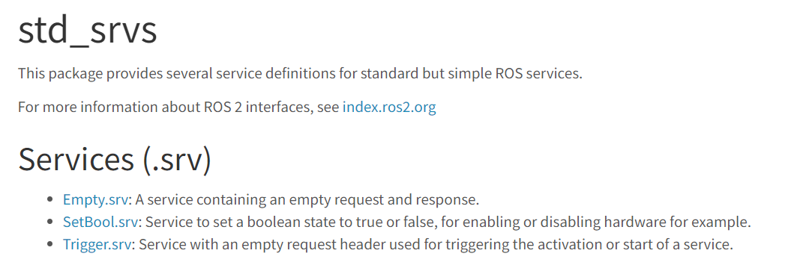

__목차__
- [ROS2 Service](#ros2-service)
      - [ROS2 Service 는 Topic 과 다르게 동기식 통신](#ros2-service-는-topic-과-다르게-동기식-통신)
      - [Client Node](#client-node)
      - [Server Client](#server-client)
  - [Service client](#service-client)
    - [turtle\_spawn.cpp](#turtle_spawncpp)
      - [Service Message](#service-message)
      - [Service Client](#service-client-1)
      - [Request](#request)
  - [Service Server](#service-server)
    - [velocity\_toggle.cpp](#velocity_togglecpp)
  - [Service Client](#service-client-2)
    - [Service Call](#service-call)
    - [실습 1: 터틀봇을 특정 위치에 spawn하는 노드 및 속도를 toggle하는 노드를 작성](#실습-1-터틀봇을-특정-위치에-spawn하는-노드-및-속도를-toggle하는-노드를-작성)
      - [spawn](#spawn)
      - [toggle](#toggle)
  - [Service Server](#service-server-1)
    - [Service Callback](#service-callback)
    - [velocity\_toggle\_plus.cpp](#velocity_toggle_pluscpp)
    - [실습 2: change\_rate.srv 를 만들어 float64 를 이용하여, 제어 주기를 바꿔주는 srv 만들기](#실습-2-change_ratesrv-를-만들어-float64-를-이용하여-제어-주기를-바꿔주는-srv-만들기)


# ROS2 Service
#### ROS2 Service 는 Topic 과 다르게 동기식 통신  
+ Bi-directional ( 양 노드간 통신 )
+ one-to-one (다수의 익명 노드가 아니라 request / response 하는 2개의 node가 있음)

#### Client Node
일부 데이터를 요청 (Request) 하여 Server Node에 보냄

#### Server Client  
Client Node에서 요청 받은 작업 (ex. 앞으로 가라, 연산을 해라 등) 을 수행하고 이를 다시 클라이언트에게 보냄!



+ turtlesim_node를 키고 service를 확인
```
$ ros2 run turtlesim turtlesim_node
```
```
$ ros2 service list
```


+ ros2 service call 을 이용하여 turtlebot 소환
```
$ ros2 service call /spawn turtlesim/srv/Spawn "{x: 3.0, y: 3.0, theta: 0.0, name: 'Myturtle'}"
```



## Service client
### turtle_spawn.cpp
```cpp
#include "rclcpp/rclcpp.hpp"
#include "turtlesim/srv/spawn.hpp"
#include <chrono>
#include <cstdlib>
#include <memory>

int main(int argc, char **argv) {
    rclcpp::init(argc, argv);
    auto node = rclcpp::Node::make_shared("spawn_turtle_client");

    // Create a client to call the 'spawn' service from turtlesim_node
    auto client = node->create_client<turtlesim::srv::Spawn>("spawn");

    // Wait for the 'spawn' service to become available
    while (!client->wait_for_service()) {
        if (!rclcpp::ok()) {
        RCLCPP_ERROR(rclcpp::get_logger("rclcpp"), "Interrupted while waiting for the service. Exiting.");
        return 0;
        }
        RCLCPP_INFO(rclcpp::get_logger("rclcpp"), "service not available, waiting again...");
    }

    // Create a request with desired values
    auto request = std::make_shared<turtlesim::srv::Spawn::Request>();
    request->x = 5.0; // Set the X coordinate for the new turtle
    request->y = 2.0; // Set the Y coordinate for the new turtle
    request->name = "new_turtle"; // Set the name for the new turtle

    // Call the 'spawn' service with the request
    auto result = client->async_send_request(request);

    // Wait for the service response
    if (rclcpp::spin_until_future_complete(node, result) == rclcpp::FutureReturnCode::SUCCESS) {
        auto response = result.get();
        RCLCPP_INFO(node->get_logger(), "Successfully spawned a new turtle: %s", response->name.c_str());
    } else {
        RCLCPP_ERROR(node->get_logger(), "Failed to spawn a new turtle.");
    }

    rclcpp::shutdown();
    return 0;
}
```

#### Service Message
+ Service Message를 include
  + Client
  + Request
  + Response



```cpp
#include "turtlesim/srv/spawn.hpp"
```

#### Service Client
+ Client 생성
```cpp
auto client = node->create_client<turtlesim::srv::Spawn>("spawn");
```

+ Server가 켜질 때까지 wait
  + server가 켜지면 client->wait_for_service()가 true가 됨
```cpp
while (!client->wait_for_service()) {
    if (!rclcpp::ok()) {
    RCLCPP_ERROR(rclcpp::get_logger("rclcpp"), "Interrupted while waiting for the service. Exiting.");
    return 0;
    }
    RCLCPP_INFO(rclcpp::get_logger("rclcpp"), "service not available, waiting again...");
}
```

#### Request
+ request를 생성하고, 값을 대입
```cpp
// Create a request with desired values
auto request = std::make_shared<turtlesim::srv::Spawn::Request>();
request->x = 5.0; // Set the X coordinate for the new turtle
request->y = 2.0; // Set the Y coordinate for the new turtle
request->name = "new_turtle"; // Set the name for the new turtle
```

+ Call
  + request에 값을 넣은 후에 client를 통해 server에 call
  + result에는 server에서 보낸 result가 저장
```cpp
// Call the 'spawn' service with the request
auto result = client->async_send_request(request);
```

+ Result
  + server가 성공적으로 service를 제공한다면, response에 result.get()을 저장
  ```cpp
  // Wait for the service response
  if (rclcpp::spin_until_future_complete(node, result) == rclcpp::FutureReturnCode::SUCCESS) {
      auto response = result.get();
      RCLCPP_INFO(node->get_logger(), "Successfully spawned a new turtle: %s", response->name.c_str());
  } else {
      RCLCPP_ERROR(node->get_logger(), "Failed to spawn a new turtle.");
  }
  ```

## Service Server
### velocity_toggle.cpp
Service가 Call 될 때마다 직진하거나 회전하는 code
```cpp
#include "rclcpp/rclcpp.hpp"
#include "std_srvs/srv/empty.hpp"
#include "geometry_msgs/msg/twist.hpp"
bool forward = true;
int cnt = 0;

bool toggleForward(
    const std::shared_ptr<std_srvs::srv::Empty::Request> request,
    std::shared_ptr<std_srvs::srv::Empty::Response> response) {
    cnt++;
    forward = !forward;
    RCLCPP_INFO(rclcpp::get_logger("rclcpp"), "Now sending %s commands.", forward ? "forward" : "rotate");
    return true;
}

int main(int argc, char **argv) {
    rclcpp::init(argc, argv);
    auto node = rclcpp::Node::make_shared("pubvel_toggle");
    
    auto server = node->create_service<std_srvs::srv::Empty>("toggle_forward", toggleForward);

    auto pub = node->create_publisher<geometry_msgs::msg::Twist>("turtle1/cmd_vel", 10);
    
    rclcpp::Rate rate(2);
    auto msg = std::make_shared<geometry_msgs::msg::Twist>();
    while (rclcpp::ok()) {
       
        msg->linear.x = forward ? 1.0 : 0.0;
        msg->angular.z = forward ? 0.0 : 1.0;
        
        if (cnt > 0) {
            
            pub->publish(*msg);
        }

        rclcpp::spin_some(node);
        rate.sleep();
    }

    rclcpp::shutdown();
    return 0;
}
```

+ Service Call시 실행되는 함수
  + 인자로 Request, Response 로 받아야 함

```cpp
bool toggleForward(
    const std::shared_ptr<std_srvs::srv::Empty::Request> request,
    std::shared_ptr<std_srvs::srv::Empty::Response> response) {
    cnt++;
    forward = !forward;
    RCLCPP_INFO(rclcpp::get_logger("rclcpp"), "Now sending %s commands.", forward ? "forward" : "rotate");
    return true;
}
```

+ Serice, Publish, Msg 등 object 생성
```cpp
auto server = node->create_service<std_srvs::srv::Empty>("toggle_forward", toggleForward);

auto pub = node->create_publisher<geometry_msgs::msg::Twist>("turtle1/cmd_vel", 10);
```

## Service Client
### Service Call
+ **Request / Response Type**: 각 Service들은 정해진 Service 규격을 따른다
```cpp
#include “turtlesim/srv/spawn.hpp”
```

+ **Client Object**: 각 Services는 지정된 Service Object를 통해 “호출(call)＂된다.
```cpp
node->create_client<ServiceType>(“Servicename”)
```

ServiceType:
part inside the angle brackets — formally called the template parameter — is the data type for the service
(본 예제에서는 turtlesim::srv::Spawn)

Servicename:
a string containing the name of the service on which we want to publish 
(본 예제에서는 spawn)

+ Service Object
```cpp
auto request = std::make_shared<turtlesim::srv::Spawn::Request>()

// 객체 안의 변수에 값 대입
request->x
request->y
request->name

// Service 요청 (request 객체 전달)
auto result = client->async_send_request(request)
```

### 실습 1: 터틀봇을 특정 위치에 spawn하는 노드 및 속도를 toggle하는 노드를 작성
#### spawn

+ x: 5, y: 2에 new_turtle을 spawn하는 service
    ```
    $ ros2 run turtlesim turtlesim_node

    $ ros2 run service_tutorial turtle_spawn_service
    ```

+ 같은 역할을 하는 명령어
    ```
    $ ros2 service call /spawn turtlesim/srv/Spawn “{x:2.0 ,  y:2.0 ,  theta: 0.0, name: ‘myturtle’}”
    ```

#### toggle
+ service server를 키는 것
```
    $ ros2 run turtlesim turtlesim_node

    $ ros2 run service_tutorial velocity_toggle_service
```

+ Call 할 때마다 toggle service 작동
    ```
    $ ros2 service call /toggle_forward std_srvs/srv/Empty
    ```

## Service Server
### Service Callback
+ **Service CallBack**: Topic의 Subscribe 와 마찬가지로 CallBack Funtion이 존재
```cpp
void function_name(const std::shared_ptr<packag_name::service_type::Request> request,
                        std::shared_ptr<packag_name::service_type::Response> response)
{
    ...
}
```

+ **Server Object**: 각 Service들은 지정된 Service Object를 통해 CallBack Function와 결합됨
```cpp
rclcpp::Service<package_name::srv::Service>::SharedPtr service =
    node->create_service<package_name::srv::Service>(“servicename”, &callback)
```

+ **Standard Service**: https://index.ros.org/p/std_srvs/#foxy


+ **Custom Service**
```srv
# request msgs
msg_type msg_name
...

---
# response msgs
msg_type msg_name
```

example - turtlesim/srv/spawn.srv


### velocity_toggle_plus.cpp
custom srv: control frequency를 바꿔주는 Service
```cpp
#include "rclcpp/rclcpp.hpp"
#include "std_srvs/srv/empty.hpp"
#include "geometry_msgs/msg/twist.hpp"
#include "my_srv/srv/changerate.hpp"

bool forward = true;
double newfrequency = 3;
bool ratechanged = false;
int cnt = 0;

bool toggleForward(
    const std::shared_ptr<std_srvs::srv::Empty::Request> request,
    std::shared_ptr<std_srvs::srv::Empty::Response> response) {
    cnt++;
    forward = !forward;
    RCLCPP_INFO(rclcpp::get_logger("rclcpp"), "Now sending %s commands.", forward ? "forward" : "rotate");
    return true;
}

bool changeRate(
    const std::shared_ptr<my_srv::srv::Changerate::Request> request,
    std::shared_ptr<my_srv::srv::Changerate::Response> response) {
    RCLCPP_INFO(rclcpp::get_logger("rclcpp"), "Changing rate to %f", request->newrate);

    newfrequency = request->newrate;
    ratechanged = true;
    return true;
}

int main(int argc, char **argv) {
    rclcpp::init(argc, argv);
    auto node = rclcpp::Node::make_shared("pubvel_toggle_rate");

    auto server = node->create_service<std_srvs::srv::Empty>("toggle_forward", toggleForward);
    auto server0 = node->create_service<my_srv::srv::Changerate>("change_rate", changeRate);

    auto pub = node->create_publisher<geometry_msgs::msg::Twist>("turtle1/cmd_vel", 10);

    
    auto msg = std::make_shared<geometry_msgs::msg::Twist>();
    while (rclcpp::ok()) {
        msg->linear.x = forward ? 1.0 : 0.0;
        msg->angular.z = forward ? 0.0 : 1.0;
        if (cnt >= 0) {
            pub->publish(*msg);
        }
        rclcpp::spin_some(node);
        
        
        if (ratechanged) {
            rclcpp::Rate rate(newfrequency);
            rate.sleep();
        }
        else{
           rclcpp::Rate rate(2);	
           rate.sleep();
        }
        
    }

    rclcpp::shutdown();
    return 0;
}
```

+ custom msg include
```cpp
#include "my_srv/srv/changerate.hpp"
```

my_srv/srv/changerate.srv
```srv
float64 newrate
---
bool ret
```

+ Change Rate에 대한 Service CallBack Function
```cpp
bool changeRate(
    const std::shared_ptr<my_srv::srv::Changerate::Request> request,
    std::shared_ptr<my_srv::srv::Changerate::Response> response) {
    RCLCPP_INFO(rclcpp::get_logger("rclcpp"), "Changing rate to %f", request->newrate);

    newfrequency = request->newrate;
    ratechanged = true;
    return true;
}
```

+ custom service에 대한 server 생성
```cpp
auto server0 = node->create_service<my_srv::srv::Changerate>("change_rate", changeRate);
```

### 실습 2: change_rate.srv 를 만들어 float64 를 이용하여, 제어 주기를 바꿔주는 srv 만들기
+ 명령어
```
$ ros2 run turtlesim turtlesim_node

$ ros2 run service_tutorial velocity_toggle_plus_service
$ ros2 service call /change_rate my_srv/srv/Changerate newrate:\value \
```