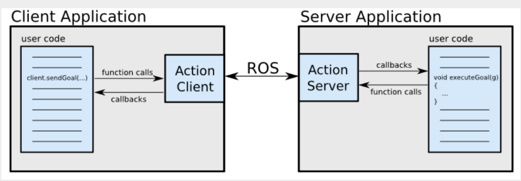

__목차__
- [ROS2 Action](#ros2-action)
      - [ROS2 Action은 Service와 다르게 비동기식 통신](#ros2-action은-service와-다르게-비동기식-통신)
  - [Custom Action](#custom-action)
    - [.action 형식](#action-형식)
    - [CMakeLists.txt의 구성](#cmakeliststxt의-구성)
    - [package.xml의 구성](#packagexml의-구성)
    - [Example - action\_tutorial\_interfaces](#example---action_tutorial_interfaces)
      - [Fibonacci.action](#fibonacciaction)
      - [CMakeLists.txt](#cmakeliststxt)
      - [package.xml](#packagexml)
  - [Action Server](#action-server)
    - [fibonacci\_action\_server.cpp](#fibonacci_action_servercpp)
      - [Create Server](#create-server)
  - [Action Client](#action-client)
    - [fibonacci\_action\_client.cpp](#fibonacci_action_clientcpp)
      - [Create Client](#create-client)


# ROS2 Action
#### ROS2 Action은 Service와 다르게 비동기식 통신

- ROS2 Action는 ROS 메시지 위에 구축된 ROS2 Action Protocol을 통해 통신하는 두 노드(액션 클라이언트와 액션 서버) 간의 요청/응답 상호 작용을 허용
- 그런 다음 클라이언트와 서버는 사용자가 함수 호출 및 콜백을 통해 목표(클라이언트 측)를 요청하거나 목표(서버 측)를 실행할 수 있는 간단한 API를 제공



+ **Goal**: "관절을 90도로 이동"과 같이 작업 클라이언트가 작업 서버로 보낸 요청
+ **Feedback**: 요청이 처리되는 동안 액션 서버가 액션 클라이언트로 피드백하는 정보(예: 이동 중인 관절의 현재 값)
+ **Result**: 요청이 이행된 후 작업 서버에서 작업 클라이언트로 전송되는 최종 정보이며 계산 결과


## Custom Action
### .action 형식
+ Request, Result, Feedback은 '---' 으로 구분됨
```action
# Request
int32 order
    ...

---
# Result
int32[] sequence
    ...

---
# Feedback
int32[] partial_sequence
    ...

```

### CMakeLists.txt의 구성
```cmake
cmake_minimum_required(VERSION 3.5)

project(my_action_tutorial)

find_package(ament_cmake REQUIRED)

…
find_package(rosidl_default_generators REQUIRED)

rosidl_generate_interfaces(${PROJECT_NAME}
	“action/<액션파일이름.action>”)

add_library(노드 이름 SHARED
	src/<소스파일.cpp>)

target_include_directories(…)

target_compile_definitions(…)

ament_target_dependencies(…)

rclcpp_components_register_node(…)

install(…)
…
```

+ Action 등록
  + rosidl_default_generator package가 필요함
  + roidl_generate_interfaces를 통해 action file을 등록
```cmake
find_package(rosidl_default_generators REQUIRED)

rosidl_generate_interfaces(${PROJECT_NAME}
	“action/<액션파일이름.action>”)
```

+ Action Server 및 Client 등록시, 사용 node를 통해 설정
```cmake
add_library(노드 이름 SHARED
	src/<소스파일.cpp>)

target_include_directories(…)

target_compile_definitions(…)

ament_target_dependencies(…)

rclcpp_components_register_node(…)

install(…)
```

### package.xml의 구성
+ Action 등록시 필요한 의존성 지정
```xml
<buildtool_depend>rosidl_default_generators</buildtool_depend>

<depend>action_msgs</depend>

<member_of_group>rosidl_interface_packages</member_of_group>
```

### Example - action_tutorial_interfaces
#### Fibonacci.action
```action
int32 order
---
int32[] sequence
---
int32[] partial_sequence

```

#### CMakeLists.txt
```cmake
cmake_minimum_required(VERSION 3.5)
project(action_tutorials_interfaces)

# Default to C99
if(NOT CMAKE_C_STANDARD)
  set(CMAKE_C_STANDARD 99)
endif()

# Default to C++14
if(NOT CMAKE_CXX_STANDARD)
  set(CMAKE_CXX_STANDARD 14)
endif()

if(CMAKE_COMPILER_IS_GNUCXX OR CMAKE_CXX_COMPILER_ID MATCHES "Clang")
  add_compile_options(-Wall -Wextra -Wpedantic)
endif()

# find dependencies
find_package(ament_cmake REQUIRED)
find_package(rosidl_default_generators REQUIRED)

rosidl_generate_interfaces(${PROJECT_NAME}
  "action/Fibonacci.action")

if(BUILD_TESTING)
  find_package(ament_lint_auto REQUIRED)
  ament_lint_auto_find_test_dependencies()
endif()

ament_package()
```

+ find dependencies
  + colcon build를 위한 ament_cmake
  + custom action을 사용하기 위한 rosidl_default_generators
```cmake
find_package(ament_cmake REQUIRED)
find_package(rosidl_default_generators REQUIRED)
```

+ 이 project에 custom action을 사용하기 위한 interface 생성
  + action file의 경로를 적어줘야 함
```cmake
rosidl_generate_interfaces(${PROJECT_NAME} "action/Fibonacci.action")
```

#### package.xml
```xml
<?xml version="1.0"?>
<?xml-model href="http://download.ros.org/schema/package_format3.xsd" schematypens="http://www.w3.org/2001/XMLSchema"?>
<package format="3">
  <name>action_tutorials_interfaces</name>
  <version>0.9.4</version>
  <description>Action tutorials action</description>
  <maintainer email="mabel@openrobotics.org">Mabel Zhang</maintainer>
  <maintainer email="michael.jeronimo@openrobotics.org">Michael Jeronimo</maintainer>
  <license>Apache License 2.0</license>
  <author email="jacob@openrobotics.org">Jacob Perron</author>

  <buildtool_depend>ament_cmake</buildtool_depend>
  <buildtool_depend>rosidl_default_generators</buildtool_depend>

  <depend>action_msgs</depend>

  <exec_depend>rosidl_default_runtime</exec_depend>

  <test_depend>ament_lint_auto</test_depend>
  <test_depend>ament_lint_common</test_depend>

  <member_of_group>rosidl_interface_packages</member_of_group>
  <export>
    <build_type>ament_cmake</build_type>
  </export>
</package>
```

+ buildtool_depend
  + colcon build를 위한 ament_cmake
  + 이 package에서 action을 사용하기 위한 rosidl_default_generators
```xml
<buildtool_depend>ament_cmake</buildtool_depend>
<buildtool_depend>rosidl_default_generators</buildtool_depend>
```

+ depend
  + action msg package가 필요하다는 것을 명시
```xml
<depend>action_msgs</depend>
```

+ exec_depend
  + rosidl_default_generators와 같이 사용되어야 하므로


## Action Server
+ **execute** : 클라이언트에서 goal이 들어오면, 집행하는 콜백 함수  

액션 콜백은 모든 처리가 완료되는 곳. 목표 값에 도달하거나 작업이 선점될 때까지 반복. 현재 값이 목표 값에 도달하면 최종 결과가 result 변수에 저장되고 성공이 publish됩니다.
그렇지 않으면 현재 결과가 feedback 변수에 저장되고 publish됩니다

+ **handle_goal**

Goal값을 입력받은 것을 확인

+ **handle_cancel**

request가 취소되었는지를 확인

### fibonacci_action_server.cpp
```cpp
#include <memory>

#include "action_tutorials_interfaces/action/fibonacci.hpp"
#include "rclcpp/rclcpp.hpp"

#include "rclcpp_action/rclcpp_action.hpp"
#include "rclcpp_components/register_node_macro.hpp"

#include "action_tutorials_cpp/visibility_control.h"

namespace action_tutorials_cpp
{
class FibonacciActionServer : public rclcpp::Node
{
public:
  using Fibonacci = action_tutorials_interfaces::action::Fibonacci;
  using GoalHandleFibonacci = rclcpp_action::ServerGoalHandle<Fibonacci>;

  ACTION_TUTORIALS_CPP_PUBLIC
  explicit FibonacciActionServer(const rclcpp::NodeOptions & options = rclcpp::NodeOptions())
  : Node("fibonacci_action_server", options)
  {
    using namespace std::placeholders;

    this->action_server_ = rclcpp_action::create_server<Fibonacci>(
      this->get_node_base_interface(),
      this->get_node_clock_interface(),
      this->get_node_logging_interface(),
      this->get_node_waitables_interface(),
      "fibonacci",
      std::bind(&FibonacciActionServer::handle_goal, this, _1, _2),
      std::bind(&FibonacciActionServer::handle_cancel, this, _1),
      std::bind(&FibonacciActionServer::handle_accepted, this, _1));
  }

private:
  rclcpp_action::Server<Fibonacci>::SharedPtr action_server_;

  ACTION_TUTORIALS_CPP_LOCAL
  rclcpp_action::GoalResponse handle_goal(
    const rclcpp_action::GoalUUID & uuid,
    std::shared_ptr<const Fibonacci::Goal> goal)
  {
    RCLCPP_INFO(this->get_logger(), "Received goal request with order %d", goal->order);
    (void)uuid;
    // Let's reject sequences that are over 9000
    if (goal->order > 9000) {
      return rclcpp_action::GoalResponse::REJECT;
    }
    return rclcpp_action::GoalResponse::ACCEPT_AND_EXECUTE;
  }

  ACTION_TUTORIALS_CPP_LOCAL
  rclcpp_action::CancelResponse handle_cancel(
    const std::shared_ptr<GoalHandleFibonacci> goal_handle)
  {
    RCLCPP_INFO(this->get_logger(), "Received request to cancel goal");
    (void)goal_handle;
    return rclcpp_action::CancelResponse::ACCEPT;
  }

  ACTION_TUTORIALS_CPP_LOCAL
  void handle_accepted(const std::shared_ptr<GoalHandleFibonacci> goal_handle)
  {
    using namespace std::placeholders;
    // this needs to return quickly to avoid blocking the executor, so spin up a new thread
    std::thread{std::bind(&FibonacciActionServer::execute, this, _1), goal_handle}.detach();
  }

  ACTION_TUTORIALS_CPP_LOCAL
  void execute(const std::shared_ptr<GoalHandleFibonacci> goal_handle)
  {
    RCLCPP_INFO(this->get_logger(), "Executing goal");
    rclcpp::Rate loop_rate(1);
    const auto goal = goal_handle->get_goal();
    auto feedback = std::make_shared<Fibonacci::Feedback>();
    auto & sequence = feedback->partial_sequence;
    sequence.push_back(0);
    sequence.push_back(1);
    auto result = std::make_shared<Fibonacci::Result>();

    for (int i = 1; (i < goal->order) && rclcpp::ok(); ++i) {
      // Check if there is a cancel request
      if (goal_handle->is_canceling()) {
        result->sequence = sequence;
        goal_handle->canceled(result);
        RCLCPP_INFO(this->get_logger(), "Goal canceled");
        return;
      }
      // Update sequence
      sequence.push_back(sequence[i] + sequence[i - 1]);
      // Publish feedback
      goal_handle->publish_feedback(feedback);
      RCLCPP_INFO(this->get_logger(), "Publish feedback");

      loop_rate.sleep();
    }

    // Check if goal is done
    if (rclcpp::ok()) {
      result->sequence = sequence;
      goal_handle->succeed(result);
      RCLCPP_INFO(this->get_logger(), "Goal succeeded");
    }
  }
};  // class FibonacciActionServer

}  // namespace action_tutorials_cpp

RCLCPP_COMPONENTS_REGISTER_NODE(action_tutorials_cpp::FibonacciActionServer)
```

#### Create Server
```cpp
this->action_server_ = rclcpp_action::create_server<Fibonacci>(
    this->get_node_base_interface(),
    this->get_node_clock_interface(),
    this->get_node_logging_interface(),
    this->get_node_waitables_interface(),
    "fibonacci",
    std::bind(&FibonacciActionServer::handle_goal, this, _1, _2),
    std::bind(&FibonacciActionServer::handle_cancel, this, _1),
    std::bind(&FibonacciActionServer::handle_accepted, this, _1));
```

+ handle_goal
  + goal 값을 입력받았는 지 확인
```cpp
ACTION_TUTORIALS_CPP_LOCAL
rclcpp_action::GoalResponse handle_goal(
const rclcpp_action::GoalUUID & uuid,
std::shared_ptr<const Fibonacci::Goal> goal)
{
RCLCPP_INFO(this->get_logger(), "Received goal request with order %d", goal->order);
(void)uuid;
// Let's reject sequences that are over 9000
if (goal->order > 9000) {
    return rclcpp_action::GoalResponse::REJECT;
}
return rclcpp_action::GoalResponse::ACCEPT_AND_EXECUTE;
}
```

+ handle_cancel
  + request가 취소되었는지를 확인
```cpp
ACTION_TUTORIALS_CPP_LOCAL
rclcpp_action::CancelResponse handle_cancel(
const std::shared_ptr<GoalHandleFibonacci> goal_handle)
{
RCLCPP_INFO(this->get_logger(), "Received request to cancel goal");
(void)goal_handle;
return rclcpp_action::CancelResponse::ACCEPT;
}
```

+ handle_accepted
  + excute를 실행
```cpp
ACTION_TUTORIALS_CPP_LOCAL
void handle_accepted(const std::shared_ptr<GoalHandleFibonacci> goal_handle)
{
using namespace std::placeholders;
// this needs to return quickly to avoid blocking the executor, so spin up a new thread
std::thread{std::bind(&FibonacciActionServer::execute, this, _1), goal_handle}.detach();
}
```

+ execute
  + server의 핵심적인 역할
```cpp
ACTION_TUTORIALS_CPP_LOCAL
void execute(const std::shared_ptr<GoalHandleFibonacci> goal_handle)
{
RCLCPP_INFO(this->get_logger(), "Executing goal");
rclcpp::Rate loop_rate(1);
const auto goal = goal_handle->get_goal();
auto feedback = std::make_shared<Fibonacci::Feedback>();
auto & sequence = feedback->partial_sequence;
sequence.push_back(0);
sequence.push_back(1);
auto result = std::make_shared<Fibonacci::Result>();

for (int i = 1; (i < goal->order) && rclcpp::ok(); ++i) {
    // Check if there is a cancel request
    if (goal_handle->is_canceling()) {
    result->sequence = sequence;
    goal_handle->canceled(result);
    RCLCPP_INFO(this->get_logger(), "Goal canceled");
    return;
    }
    // Update sequence
    sequence.push_back(sequence[i] + sequence[i - 1]);
    // Publish feedback
    goal_handle->publish_feedback(feedback);
    RCLCPP_INFO(this->get_logger(), "Publish feedback");

    loop_rate.sleep();
}

// Check if goal is done
if (rclcpp::ok()) {
    result->sequence = sequence;
    goal_handle->succeed(result);
    RCLCPP_INFO(this->get_logger(), "Goal succeeded");
}
}
```

## Action Client
+ Send_goal

Goal이 정의된 다음 send_goal 함수를 통해 전달

+ Goal_response_callback

Server이 정상적으로 Goal을 받았는지 Check

+ Feedback_callback

feedback값 출력

+ Result_callback

action결과 출력


### fibonacci_action_client.cpp
```cpp
#include <functional>
#include <future>
#include <memory>
#include <string>
#include <sstream>

#include "action_tutorials_interfaces/action/fibonacci.hpp"

#include "rclcpp/rclcpp.hpp"
#include "rclcpp_action/rclcpp_action.hpp"
#include "rclcpp_components/register_node_macro.hpp"

namespace action_tutorials_cpp
{
class FibonacciActionClient : public rclcpp::Node
{
public:
  using Fibonacci = action_tutorials_interfaces::action::Fibonacci;
  using GoalHandleFibonacci = rclcpp_action::ClientGoalHandle<Fibonacci>;

  explicit FibonacciActionClient(const rclcpp::NodeOptions & options)
  : Node("fibonacci_action_client", options)
  {
    this->client_ptr_ = rclcpp_action::create_client<Fibonacci>(
      this,
      "fibonacci");

    this->timer_ = this->create_wall_timer(
      std::chrono::milliseconds(500),
      std::bind(&FibonacciActionClient::send_goal, this));
  }

  void send_goal()
  {
    using namespace std::placeholders;

    this->timer_->cancel();

    if (!this->client_ptr_->wait_for_action_server()) {
      RCLCPP_ERROR(this->get_logger(), "Action server not available after waiting");
      rclcpp::shutdown();
    }

    auto goal_msg = Fibonacci::Goal();
    goal_msg.order = 10;

    RCLCPP_INFO(this->get_logger(), "Sending goal");

    auto send_goal_options = rclcpp_action::Client<Fibonacci>::SendGoalOptions();
    send_goal_options.goal_response_callback =
      std::bind(&FibonacciActionClient::goal_response_callback, this, _1);
    send_goal_options.feedback_callback =
      std::bind(&FibonacciActionClient::feedback_callback, this, _1, _2);
    send_goal_options.result_callback =
      std::bind(&FibonacciActionClient::result_callback, this, _1);
    this->client_ptr_->async_send_goal(goal_msg, send_goal_options);
  }

private:
  rclcpp_action::Client<Fibonacci>::SharedPtr client_ptr_;
  rclcpp::TimerBase::SharedPtr timer_;

  void goal_response_callback(const GoalHandleFibonacci::SharedPtr & goal_handle)
  {
    if (!goal_handle) {
      RCLCPP_ERROR(this->get_logger(), "Goal was rejected by server");
    } else {
      RCLCPP_INFO(this->get_logger(), "Goal accepted by server, waiting for result");
    }
  }

  void feedback_callback(
    GoalHandleFibonacci::SharedPtr,
    const std::shared_ptr<const Fibonacci::Feedback> feedback)
  {
    std::stringstream ss;
    ss << "Next number in sequence received: ";
    for (auto number : feedback->partial_sequence) {
      ss << number << " ";
    }
    RCLCPP_INFO(this->get_logger(), ss.str().c_str());
  }

  void result_callback(const GoalHandleFibonacci::WrappedResult & result)
  {
    switch (result.code) {
      case rclcpp_action::ResultCode::SUCCEEDED:
        break;
      case rclcpp_action::ResultCode::ABORTED:
        RCLCPP_ERROR(this->get_logger(), "Goal was aborted");
        return;
      case rclcpp_action::ResultCode::CANCELED:
        RCLCPP_ERROR(this->get_logger(), "Goal was canceled");
        return;
      default:
        RCLCPP_ERROR(this->get_logger(), "Unknown result code");
        return;
    }
    std::stringstream ss;
    ss << "Result received: ";
    for (auto number : result.result->sequence) {
      ss << number << " ";
    }
    RCLCPP_INFO(this->get_logger(), ss.str().c_str());
    rclcpp::shutdown();
  }
};  // class FibonacciActionClient

}  // namespace action_tutorials_cpp

RCLCPP_COMPONENTS_REGISTER_NODE(action_tutorials_cpp::FibonacciActionClient)
```

#### Create Client
```cpp
explicit FibonacciActionClient(const rclcpp::NodeOptions & options)
: Node("fibonacci_action_client", options)
{
this->client_ptr_ = rclcpp_action::create_client<Fibonacci>(
    this,
    "fibonacci");

this->timer_ = this->create_wall_timer(
    std::chrono::milliseconds(500),
    std::bind(&FibonacciActionClient::send_goal, this));
}
```

+ send_goal
```cpp
void send_goal()
{
using namespace std::placeholders;

this->timer_->cancel();

if (!this->client_ptr_->wait_for_action_server()) {
    RCLCPP_ERROR(this->get_logger(), "Action server not available after waiting");
    rclcpp::shutdown();
}

auto goal_msg = Fibonacci::Goal();
goal_msg.order = 10;

RCLCPP_INFO(this->get_logger(), "Sending goal");

auto send_goal_options = rclcpp_action::Client<Fibonacci>::SendGoalOptions();
send_goal_options.goal_response_callback =
    std::bind(&FibonacciActionClient::goal_response_callback, this, _1);
send_goal_options.feedback_callback =
    std::bind(&FibonacciActionClient::feedback_callback, this, _1, _2);
send_goal_options.result_callback =
    std::bind(&FibonacciActionClient::result_callback, this, _1);
this->client_ptr_->async_send_goal(goal_msg, send_goal_options);
}
```

+ goal_response_callback
  + server에서 보내는 goal에 대한 알림
```cpp
void goal_response_callback(const GoalHandleFibonacci::SharedPtr & goal_handle)
{
    if (!goal_handle) {
        RCLCPP_ERROR(this->get_logger(), "Goal was rejected by server");
    } else {
        RCLCPP_INFO(this->get_logger(), "Goal accepted by server, waiting for result");
    }
}
```

+ feedback_callback
  + server에게 feedback을 받으면 실행
```cpp
void feedback_callback(
    GoalHandleFibonacci::SharedPtr,
    const std::shared_ptr<const Fibonacci::Feedback> feedback)
{
    std::stringstream ss;
    ss << "Next number in sequence received: ";
    for (auto number : feedback->partial_sequence) {
        ss << number << " ";
    }
    RCLCPP_INFO(this->get_logger(), ss.str().c_str());
}
```

+ result_callback
  + server에게 result를 받으면 실행
```cpp
void result_callback(const GoalHandleFibonacci::WrappedResult & result)
{
    switch (result.code) {
        case rclcpp_action::ResultCode::SUCCEEDED:
        break;
        case rclcpp_action::ResultCode::ABORTED:
        RCLCPP_ERROR(this->get_logger(), "Goal was aborted");
        return;
        case rclcpp_action::ResultCode::CANCELED:
        RCLCPP_ERROR(this->get_logger(), "Goal was canceled");
        return;
        default:
        RCLCPP_ERROR(this->get_logger(), "Unknown result code");
        return;
    }
    std::stringstream ss;
    ss << "Result received: ";
    for (auto number : result.result->sequence) {
        ss << number << " ";
    }
    RCLCPP_INFO(this->get_logger(), ss.str().c_str());
    rclcpp::shutdown();
}
```