__목차__
- [TF Library](#tf-library)
  - [TF](#tf)
  - [주요 특징](#주요-특징)
    - [**Listening for transform**](#listening-for-transform)
    - [**Broadcasting transform**](#broadcasting-transform)
    - [Example - state\_publisher\_example.cpp](#example---state_publisher_examplecpp)
  - [Geometry\_msgs::Pose vs Geometry\_msgs::PoseStamped](#geometry_msgspose-vs-geometry_msgsposestamped)
  - [ROS Msgs (poseStamped, transformStamped)와 tf Stamped는 다른 구조체이다.](#ros-msgs-posestamped-transformstamped와-tf-stamped는-다른-구조체이다)
- [Robot Modeling](#robot-modeling)
  - [URDF (Unified Robot Description Format)](#urdf-unified-robot-description-format)
    - [Main Tag](#main-tag)
      - [Link Tag](#link-tag)
      - [Joint Tag](#joint-tag)
      - [Robot Tag](#robot-tag)
    - [totrial1.urdf](#totrial1urdf)
    - [tutorial2.urdf](#tutorial2urdf)
- [Visualization Tool](#visualization-tool)
  - [Rviz: 3d visualization Tool](#rviz-3d-visualization-tool)
  - [Robot State Publisher](#robot-state-publisher)
    - [Urdf to Tf](#urdf-to-tf)
    - [How to Use in Launch?](#how-to-use-in-launch)
      - [tutorial\_7th의 robot\_state.launch.py를 실행시키고 tf를 살펴보자](#tutorial_7th의-robot_statelaunchpy를-실행시키고-tf를-살펴보자)

# TF Library
## TF
+ Tf (Transform) library는 다양한 로봇, 물체, 지도 frame을 동시에 추적하기 위해 사용
  - 기본적으로 Tree 구조에 시간에 따른 Buffer를 쌓음. 즉 TF는 시간 (ros time)에 매우 민감함.
  - 원격 관제를 위해서 로봇과 원격 조종 컴퓨터간의 시간을 맞추는 등의 노력이 필요.
  - 각 Frame 간의 transformation matrix 관계, vector 관계 등을 추정, 혹은 좌표 변환 시킴
    : 5초 전에 head frame은 world frame을 기준으로 어디에 위치하고 있었나?
    : 현재 내 그리퍼의 위치는 내 로봇 중심에서 얼마나 떨어져 있나?
    : 현재 내 모바일 로봇은 맵 기준으로 어디에 위치하고 있나?
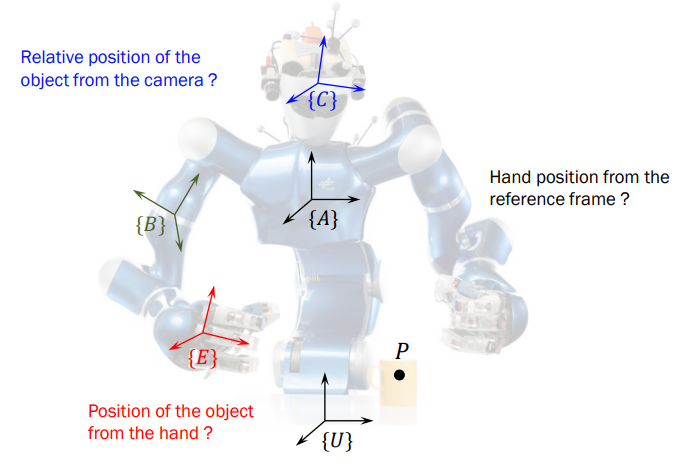

## 주요 특징
### **Listening for transform**
+ 모든 프레임, 혹은 특정 프레임을 받아보거나, 특정 시점의 프레임을 받아 볼 수 있음.
```cpp
#include <chrono>
#include <functional>
#include <memory>
#include <string>

#include "geometry_msgs/msg/transform_stamped.hpp"
#include "geometry_msgs/msg/twist.hpp"
#include "rclcpp/rclcpp.hpp"
#include "tf2/exceptions.h"
#include "tf2_ros/transform_listener.h"
#include "tf2_ros/buffer.h"
#include "turtlesim/srv/spawn.hpp"

using namespace std::chrono_literals;

class FrameListener : public rclcpp::Node
{
public:
  FrameListener()
  : Node("turtle_tf2_frame_listener"),
    turtle_spawning_service_ready_(false),
    turtle_spawned_(false)
  {
    // Declare and acquire `target_frame` parameter
    target_frame_ = this->declare_parameter<std::string>("target_frame", "turtle1");

    tf_buffer_ =
      std::make_unique<tf2_ros::Buffer>(this->get_clock());
    tf_listener_ =
      std::make_shared<tf2_ros::TransformListener>(*tf_buffer_);

    // Create a client to spawn a turtle
    spawner_ =
      this->create_client<turtlesim::srv::Spawn>("spawn");

    // Create turtle2 velocity publisher
    publisher_ =
      this->create_publisher<geometry_msgs::msg::Twist>("turtle2/cmd_vel", 1);

    // Call on_timer function every second
    timer_ = this->create_wall_timer(
      1s, std::bind(&FrameListener::on_timer, this));
  }

private:
  void on_timer()
  {
    // Store frame names in variables that will be used to
    // compute transformations
    std::string fromFrameRel = target_frame_.c_str();
    std::string toFrameRel = "turtle2";

    if (turtle_spawning_service_ready_) {
      if (turtle_spawned_) {
        geometry_msgs::msg::TransformStamped t;

        // Look up for the transformation between target_frame and turtle2 frames
        // and send velocity commands for turtle2 to reach target_frame
        try {
          t = tf_buffer_->lookupTransform(
            toFrameRel, fromFrameRel,
            tf2::TimePointZero);
        } catch (const tf2::TransformException & ex) {
          RCLCPP_INFO(
            this->get_logger(), "Could not transform %s to %s: %s",
            toFrameRel.c_str(), fromFrameRel.c_str(), ex.what());
          return;
        }

        geometry_msgs::msg::Twist msg;

        static const double scaleRotationRate = 1.0;
        msg.angular.z = scaleRotationRate * atan2(
          t.transform.translation.y,
          t.transform.translation.x);

        static const double scaleForwardSpeed = 0.5;
        msg.linear.x = scaleForwardSpeed * sqrt(
          pow(t.transform.translation.x, 2) +
          pow(t.transform.translation.y, 2));

        publisher_->publish(msg);
      } else {
        RCLCPP_INFO(this->get_logger(), "Successfully spawned");
        turtle_spawned_ = true;
      }
    } else {
      // Check if the service is ready
      if (spawner_->service_is_ready()) {
        // Initialize request with turtle name and coordinates
        // Note that x, y and theta are defined as floats in turtlesim/srv/Spawn
        auto request = std::make_shared<turtlesim::srv::Spawn::Request>();
        request->x = 4.0;
        request->y = 2.0;
        request->theta = 0.0;
        request->name = "turtle2";

        // Call request
        using ServiceResponseFuture =
          rclcpp::Client<turtlesim::srv::Spawn>::SharedFuture;
        auto response_received_callback = [this](ServiceResponseFuture future) {
            auto result = future.get();
            if (strcmp(result->name.c_str(), "turtle2") == 0) {
              turtle_spawning_service_ready_ = true;
            } else {
              RCLCPP_ERROR(this->get_logger(), "Service callback result mismatch");
            }
          };
        auto result = spawner_->async_send_request(request, response_received_callback);
      } else {
        RCLCPP_INFO(this->get_logger(), "Service is not ready");
      }
    }
  }

  // Boolean values to store the information
  // if the service for spawning turtle is available
  bool turtle_spawning_service_ready_;
  // if the turtle was successfully spawned
  bool turtle_spawned_;
  rclcpp::Client<turtlesim::srv::Spawn>::SharedPtr spawner_{nullptr};
  rclcpp::TimerBase::SharedPtr timer_{nullptr};
  rclcpp::Publisher<geometry_msgs::msg::Twist>::SharedPtr publisher_{nullptr};
  std::shared_ptr<tf2_ros::TransformListener> tf_listener_{nullptr};
  std::unique_ptr<tf2_ros::Buffer> tf_buffer_;
  std::string target_frame_;
};

int main(int argc, char * argv[])
{
  rclcpp::init(argc, argv);
  rclcpp::spin(std::make_shared<FrameListener>());
  rclcpp::shutdown();
  return 0;
}
```

+ Buffer & TransformListener
```cpp
tf_buffer_ =
    std::make_unique<tf2_ros::Buffer>(this->get_clock());
tf_listener_ =
    std::make_shared<tf2_ros::TransformListener>(*tf_buffer_);
```

+ lookupTransform
```cpp
geometry_msgs::msg::TransformStamped t;

    // Look up for the transformation between target_frame and turtle2 frames
    // and send velocity commands for turtle2 to reach target_frame
    try {
        t = tf_buffer_->lookupTransform(
        toFrameRel, fromFrameRel,
        tf2::TimePointZero);
    }
```

### **Broadcasting transform**
+ 특정 프레임을 기준으로 상대 위치 (혹은 회전)를 전송할수 있음.
```cpp
#include <functional>
#include <memory>
#include <sstream>
#include <string>

#include "geometry_msgs/msg/transform_stamped.hpp"
#include "rclcpp/rclcpp.hpp"
#include "tf2/LinearMath/Quaternion.h"
#include "tf2_ros/transform_broadcaster.h"
#include "turtlesim/msg/pose.hpp"

class FramePublisher : public rclcpp::Node
{
public:
  FramePublisher()
  : Node("turtle_tf2_frame_publisher")
  {

    turtlename_ = this->declare_parameter<std::string>("turtlename", "turtle");


    tf_broadcaster_ =
      std::make_unique<tf2_ros::TransformBroadcaster>(*this);

    std::ostringstream stream;
    stream << "/" << turtlename_.c_str() << "/pose";
    std::string topic_name = stream.str();

    subscription_ = this->create_subscription<turtlesim::msg::Pose>(
      topic_name, 10,
      std::bind(&FramePublisher::handle_turtle_pose, this, std::placeholders::_1));
  }

private:
  void handle_turtle_pose(const std::shared_ptr<turtlesim::msg::Pose> msg)
  {
    geometry_msgs::msg::TransformStamped t;

    // Read message content and assign it to
    // corresponding tf variables
    t.header.stamp = this->get_clock()->now();
    t.header.frame_id = "world";
    t.child_frame_id = turtlename_.c_str();

    // Turtle only exists in 2D, thus we get x and y translation
    // coordinates from the message and set the z coordinate to 0
    t.transform.translation.x = msg->x;
    t.transform.translation.y = msg->y;
    t.transform.translation.z = 0.0;

    // For the same reason, turtle can only rotate around one axis
    // and this why we set rotation in x and y to 0 and obtain
    // rotation in z axis from the message
    tf2::Quaternion q;
    q.setRPY(0, 0, msg->theta);
    t.transform.rotation.x = q.x();
    t.transform.rotation.y = q.y();
    t.transform.rotation.z = q.z();
    t.transform.rotation.w = q.w();

    // Send the transformation
    tf_broadcaster_->sendTransform(t);
  }

  rclcpp::Subscription<turtlesim::msg::Pose>::SharedPtr subscription_;
  std::unique_ptr<tf2_ros::TransformBroadcaster> tf_broadcaster_;
  std::string turtlename_;
};

int main(int argc, char * argv[])
{
  rclcpp::init(argc, argv);
  rclcpp::spin(std::make_shared<FramePublisher>());
  rclcpp::shutdown();
  return 0;
}
```

+ TransformBroadcaster
```cpp
tf_broadcaster_ =
    std::make_unique<tf2_ros::TransformBroadcaster>(*this);
```

+ sendTransform
```cpp
// Send the transformation
tf_broadcaster_->sendTransform(t);
```

### Example - state_publisher_example.cpp
```cpp
#include <rclcpp/rclcpp.hpp>
#include <geometry_msgs/msg/quaternion.hpp>
#include <sensor_msgs/msg/joint_state.hpp>
#include <tf2_ros/transform_broadcaster.h>
#include <tf2_ros/transform_listener.h>
#include <tf2/LinearMath/Quaternion.h>
#include <tf2/LinearMath/Matrix3x3.h>
#include <geometry_msgs/msg/transform_stamped.hpp>

#include <chrono>
#include <cmath>
#include <memory>

class StatePublisher : public rclcpp::Node
{
public:
    StatePublisher() : Node("state_publisher") {
        joint_pub = this->create_publisher<sensor_msgs::msg::JointState>("joint_states", rclcpp::QoS(10));
        broadcaster = std::make_shared<tf2_ros::TransformBroadcaster>(this);

        auto qos_profile = rclcpp::QoS(10);
        nodeName = this->get_name();
        RCLCPP_INFO(this->get_logger(), "%s started", nodeName.c_str());

        double degree = M_PI / 180.0;
        double loop_rate_hz = 30.0;
        rclcpp::Rate loop_rate(loop_rate_hz);

        // robot state
        double tilt = 0.0;
        double tinc = degree;
        double swivel = 0.0;
        double angle = 0.0;
        double height = 0.0;
        double hinc = 0.005;

        // message declarations
        auto joint_state = std::make_shared<sensor_msgs::msg::JointState>();
        joint_state->header.frame_id = "base_link";

        auto odom_trans = std::make_shared<geometry_msgs::msg::TransformStamped>();
        odom_trans->header.frame_id = "odom";
        odom_trans->child_frame_id = "axis";

        try {
            while (rclcpp::ok()) {
                rclcpp::spin_some(this->get_node_base_interface());

                // update joint_state
                auto now = this->now();
                joint_state->header.stamp = now;
                joint_state->name = {"swivel", "tilt", "periscope"};
                joint_state->position = {swivel, tilt, height};

                // update transform
                // (moving in a circle with radius=2)
                odom_trans->header.stamp = now;
                odom_trans->transform.translation.x = std::cos(angle) * 2;
                odom_trans->transform.translation.y = std::sin(angle) * 2;
                odom_trans->transform.translation.z = 0.7;

                tf2::Quaternion quat;
                quat.setRPY(0, 0, angle + M_PI / 2); // roll, pitch, yaw
                odom_trans->transform.rotation.x = quat.x();
                odom_trans->transform.rotation.y = quat.y();
                odom_trans->transform.rotation.z = quat.z();
                odom_trans->transform.rotation.w = quat.w();

                // send the joint state and transform
                joint_pub->publish(*joint_state);
                broadcaster->sendTransform(*odom_trans);

                // Create new robot state
                tilt += tinc;
                if (tilt < -0.5 || tilt > 0.0) {
                    tinc *= -1;
                }
                height += hinc;
                if (height > 0.2 || height < 0.0) {
                    hinc *= -1;
                }
                swivel += degree;
                angle += degree / 4;

                // Sleep to achieve the desired loop rate
                loop_rate.sleep();
            }
        } catch (const std::exception &e) {
            RCLCPP_ERROR(this->get_logger(), e.what());
        }
    }

private:
    rclcpp::Publisher<sensor_msgs::msg::JointState>::SharedPtr joint_pub;
    std::shared_ptr<tf2_ros::TransformBroadcaster> broadcaster;
    std::string nodeName;
};

int main(int argc, char *argv[]) {
    rclcpp::init(argc, argv);
    auto node = std::make_shared<StatePublisher>();
    rclcpp::spin(node);
    rclcpp::shutdown();
    return 0;
}
```

## Geometry_msgs::Pose vs Geometry_msgs::PoseStamped
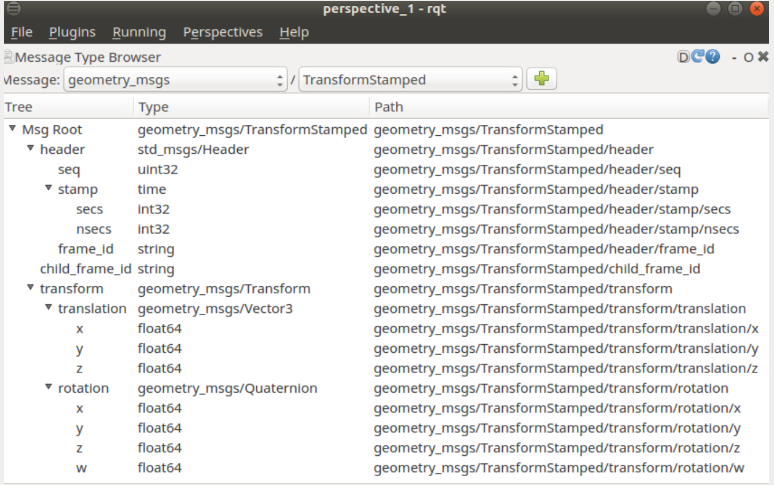

## ROS Msgs (poseStamped, transformStamped)와 tf Stamped는 다른 구조체이다.
```cpp
geometry_msgs::TransformStamped transformStamped;
tf2::Stamped<tf2::Transform> tfs;
tf2::convert(transformStamped, tfs);
```


# Robot Modeling
## URDF (Unified Robot Description Format)
- URDF는 XML 형태로 이루어져 있으며, robot, sensor, 주위 환경 및 물체 등을 묘사(description)해 놓은 파일
- 로봇의 Kinematics 정보 (링크 길이가 얼마인지?, 조인트 회전 방향이 어떤 방향인지?)
- 로봇의 Dynamcis 정보 (링크의 무게와 무게중심이 얼마인지? 바퀴의 마찰력이 얼마인지?)
- 로봇의 visual mesh
- 로봇의 collision mesh 등을 포함.

### Main Tag
#### Link Tag
로봇의 단일 링크의 성질 (mass, inertia matrix, visual information) 등을 포함하는 파일
```xml
<link name="<name of the link>">
  <inertial>...........</inertial>
  <visual> ............</visual>
  <collision>..........</collision>
</link>
```

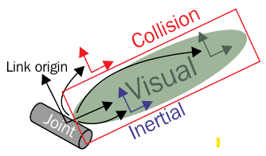

+ Package에 Urdf추가
  + CmakeLists.txt
    + Urdf를 package의 share에 추가
    ```cmake
    install (DIRECTORY urdf
        DESTINATION share/${PROJECT_NAME}
    )
    ```

#### Joint Tag
로봇의 관절 타입 (revolute, continuous, prismatic, fixed, floating 등)의 정보와 parent link와 child link 사이의 연결을 위한 정보들, 조인트 축, 마찰 정보, 댐핑 정보 등을 담고 있음
```xml
<joint name="<name of the joint>" type="<type of the joint>">
   <origin xyz="..." rpy="..."/>
   <parent link="link1"/>
   <child link="link2"/>
   <axis>"..."</axis>
   <dynamics damping="...."/>
   <limit effort="..."/>
</joint>
```

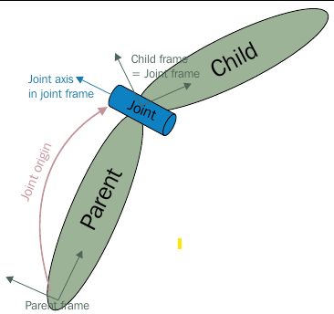

#### Robot Tag
완전체의 로봇을 Wrapping하는 최상위 Tag
```xml
<robot name="<name of the robot>"/>
  <link> ..... </link>
  <link> ...... </link>
  <joint> ....... </joint>
  <joint> ...... </joint>
</robot>
```
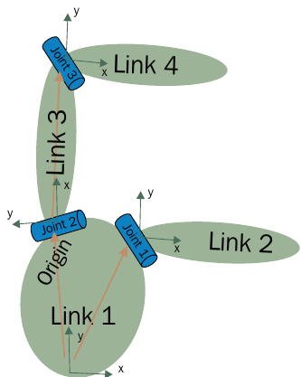

### totrial1.urdf
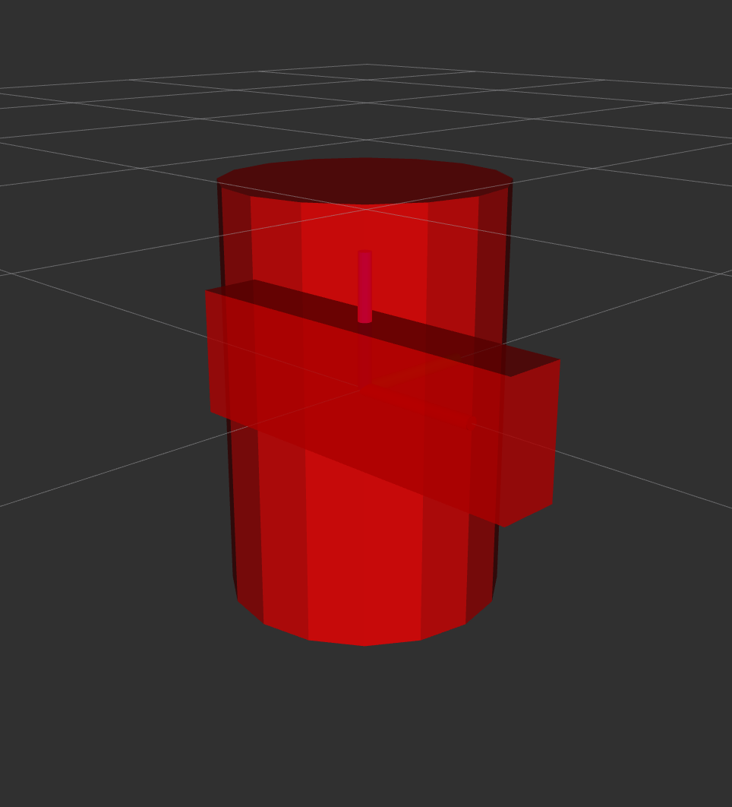
```xml
<?xml version="1.0"?>
<robot name="multipleshapes">
  <link name="base_link">
    <visual>
      <geometry>
        <cylinder length="0.6" radius="0.2"/>
      </geometry>
    </visual>
  </link>
  <link name="right_leg">
    <visual>
      <geometry>
        <box size="0.6 0.1 0.2"/>
      </geometry>
    </visual>
  </link>

  <joint name="base_to_right_leg" type="fixed">
    <parent link="base_link"/>
    <child link="right_leg"/>
  </joint>
</robot>
```


### tutorial2.urdf
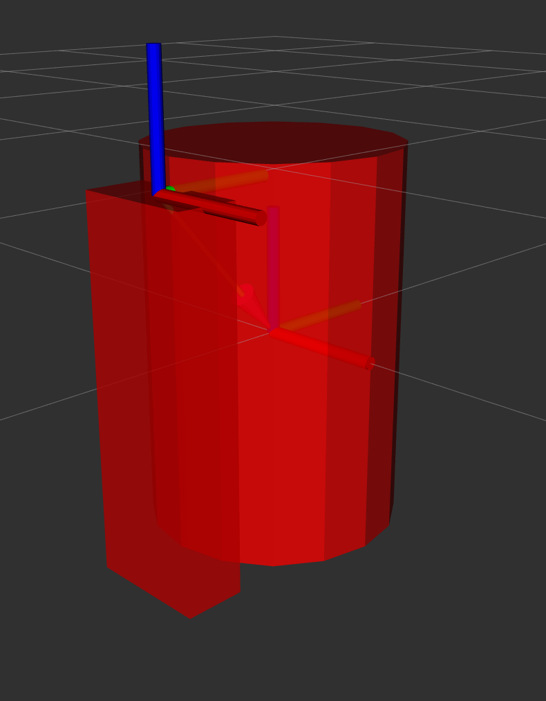
```xml
<?xml version="1.0"?>
<robot name="origins">
  <link name="base_link">
    <visual>
      <geometry>
        <cylinder length="0.6" radius="0.2"/>
      </geometry>
    </visual>
  </link>
  <link name="right_leg">
  <!-- Pitch(Y)방향으로 90° Z축 방향으로 -0.3 이동 -->
    <visual>
      <geometry>
        <box size="0.6 0.1 0.2"/>
      </geometry>
      <origin rpy="0 1.57075 0" xyz="0 0 -0.3"/>
    </visual>
  </link>

  <joint name="base_to_right_leg" type="fixed">
    <parent link="base_link"/>
    <child link="right_leg"/>
    <!-- Base link기준으로 origin점 이동 -->
    <origin xyz="0 -0.22 0.25"/>
  </joint>
</robot>
```

+ heck_urdf [urdf name] 등으로 검사 가능
+ Urdf_to_graphiz [urdf_name] 등으로 그래픽으로 볼 수 있음.


# Visualization Tool
## Rviz: 3d visualization Tool
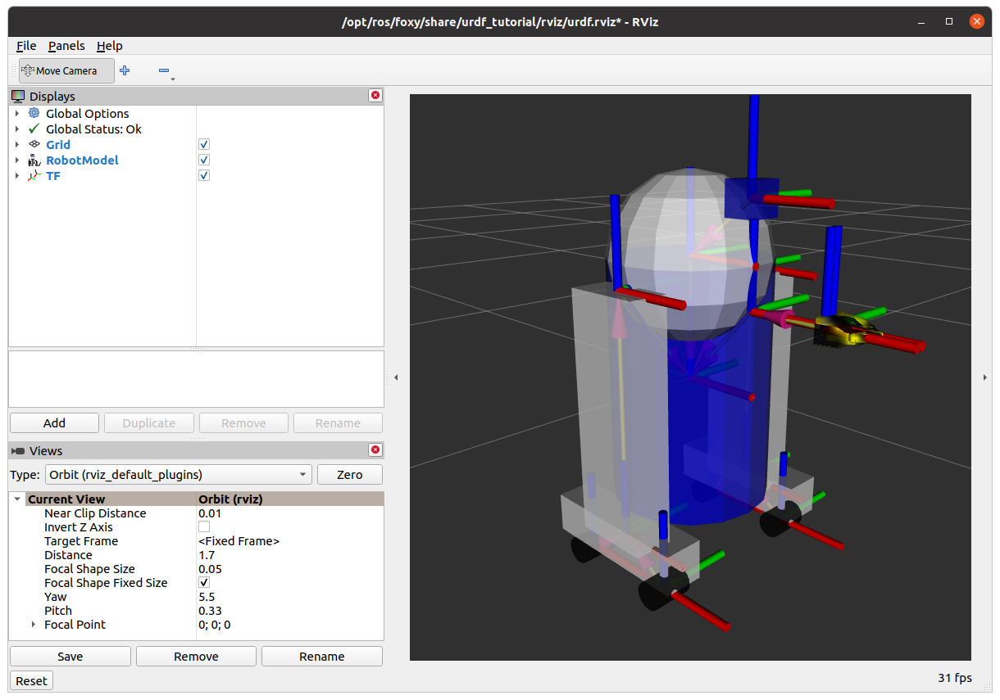

## Robot State Publisher
### Urdf to Tf
- Robot을 Control하기 위해서는 Tf를 통해 각 Link 및 Joint의 상관관계인 TF를 알아야한다.
- Robot State Publisher은 urdf파일의 정보를 Tf로 변환해 로봇의 구성요소들의 관계를 파악하게 한다.

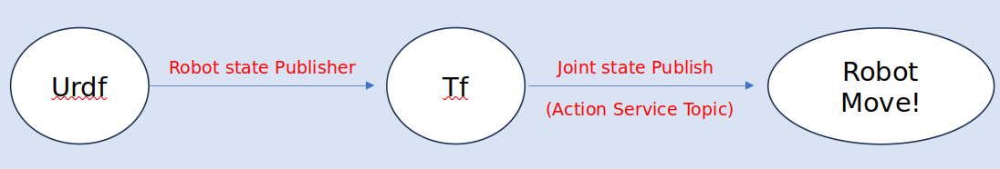

### How to Use in Launch?
```xml
Node(
	package=‘robot_state_publisher’,
	executable=‘robot_state_publisher’,
	name=‘robot_state_publisher’,
	output=‘screen’
	parameter=[{‘use_sim_time’: <user parameter>, ‘robot_description’: <user parameter>}]
	arguments==[<urdf_fime_path>]);
```

#### tutorial_7th의 robot_state.launch.py를 실행시키고 tf를 살펴보자
+ Terminal 1(in tutorial_7th)
  ```
  $ ros2 launch urdf_state_tutorial robot_state.launch.py
  ```
  ```cpp
  import os
  from ament_index_python.packages import get_package_share_directory
  from launch import LaunchDescription
  from launch.actions import DeclareLaunchArgument
  from launch.substitutions import LaunchConfiguration
  from launch_ros.actions import Node

  def generate_launch_description():

      use_sim_time = LaunchConfiguration('use_sim_time', default='false')

      urdf_file_name = 'r2d2.urdf.xml'
      urdf = os.path.join(
          get_package_share_directory('urdf_state_tutorial'),"urdf",
          urdf_file_name)
      with open(urdf, 'r') as infp:
          robot_desc = infp.read()

      return LaunchDescription([
          DeclareLaunchArgument(
              'use_sim_time',
              default_value='false',
              description='Use simulation (Gazebo) clock if true'),
          Node(
              package='robot_state_publisher',
              executable='robot_state_publisher',
              name='robot_state_publisher',
              output='screen',
              parameters=[{'use_sim_time': use_sim_time, 'robot_description': robot_desc}],
              arguments=[urdf]),
          Node(
              package='urdf_state_tutorial',
              executable='state_pulisher_node',
              name='state_publisher',
              output='screen'),
      ])
    ```
+ Terminal 2(in tutorial_7th)
  ```
  $ rviz2 –d /tutorial_7th/install/urdf_state_tutorial/share/urdf_state_tutorial/r2d2.rviz
  ```
+ Terminal 3
  ```
  $ ros2 topic echo /tf
  ```

+ Rviz
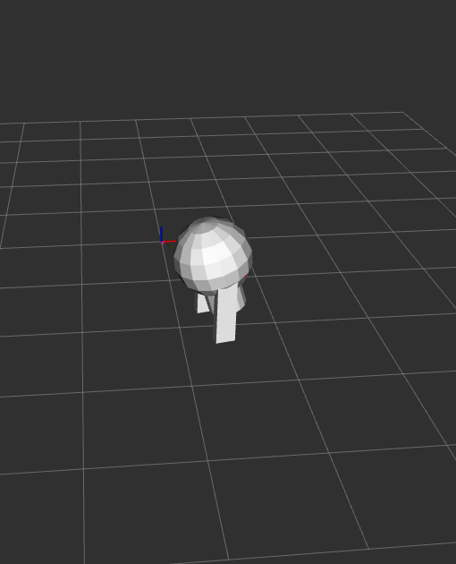

+ 각 Frame의 정보 출력(Urdf와 동일) (parent_frame/child_frame…)
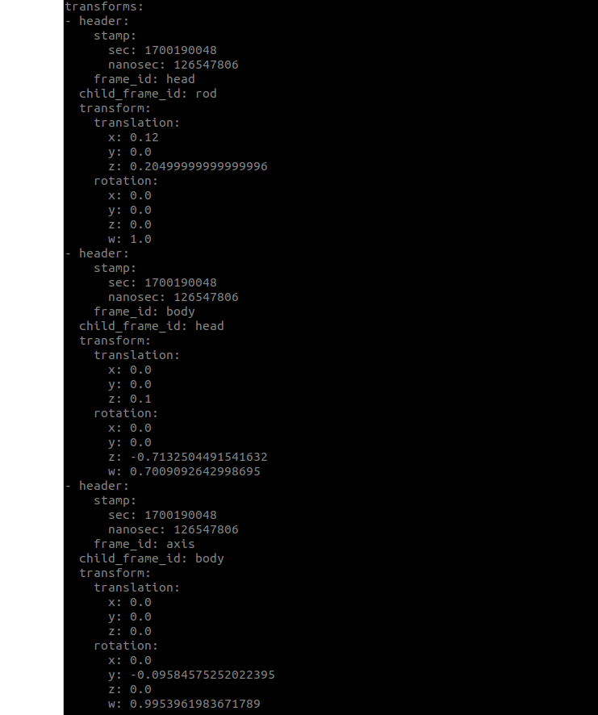


# Logging Tool
## Rosbag
실행하고 있는 msg 정보들을 담아두어 replay를 시켜준다.

+ Recoding
```
$ ros2 bag record –o filename.bag topic-names
```

+ Playbag
```
$ ros2 bag play filename.bag
```

+ Inspection
```
$ ros2 bag info filename.bag
```

### (실습 7)turtlesim_node와 turtle_teleop_key를 실행한 후 turtle1의 pose와 cmd_vel을 rosbag를 이용해 저장하고 다시 실행시켜본다.
+ Terminal 1
  ```
  $ ros2 run turtlesim turtlesim_node
  ```
+ Terminal 2
  ```
  $ ros2 run turtlesim turtle_teleop_key
  ```

+ Terminal 3
  ```
  ros2 bag record –o mybag.bag /turtle1/cmd_vel /turtle1/pose
  ```
  이 후 teleop_key를 이용해 자유롭게 turtle을 움직이기

  다 움직인 후 Ctrl+C를 통해 종료
  Terminal1의 Turtlesim_node도 종료한다.

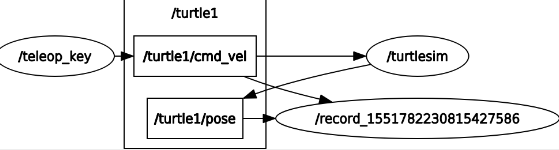

+ Terminal 3
다시 Turtlesim_node를 실행한 후 
  ```
  $ ros2 bag play mybag.bag --topics /turtle1/cmd_vel
  ```
  앞서 움직임을 따라하는 것 확인하기
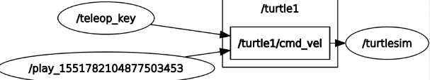


# Monitoring Tool
## RQT
- Topic Monitor, rqt_plot, rviz 등을 포함하여 관제 가능
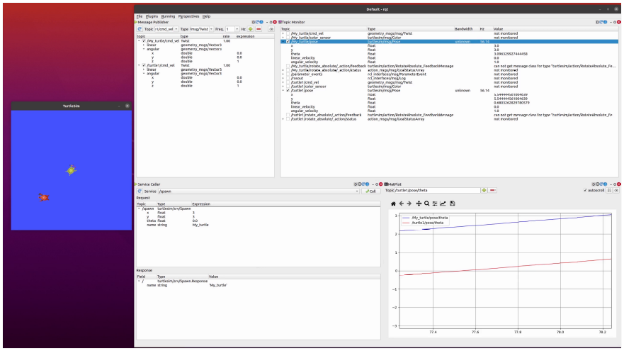

(실습 8) rqt를 구성해 볼 것
- rqt service calle를 활용하여 MyTurtle을 3,3 좌표에 소환해보기
- rqt topic publisher를 활용하여 turtle1와 MyTurtle의 각속도를 각각 1, -1로 입력해보기.
- Topic Monitor를 활용하여 각 pose들을 모니터 해볼것
- Plot Tool을 이용하여 각 로봇들의 각도들을 그래프로 나타낼 것.

+ Terminal1
  ```
  $ ros2 run turtlesim turtlesim_node
  ```
+ Terminal2
  ```
  $ rqt
  ```